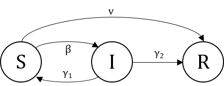
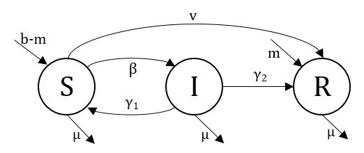

###### **Main contact for this notebook: Dr. Rabia Aziza (rabia.aziza@warwick.ac.uk)**
<br>

### 3. SIR without demography

```{r}
## Create an SIR function
sir <- function(time, state, parameters) {
  with(as.list(c(state, parameters)), {
    dS <- -beta * S * I
    dI <-  beta * S * I - gamma * I
    dR <-  gamma * I
    return(list(c(dS, dI, dR)))
  })
}
## beta: infection parameter; gamma: recovery parameter
parameters <- c(beta=1.0, gamma=0.5)

## Proportion in each compartment: [S0, I0, R0]
init <- c(S=1-1e-6, I=1e-6, R=0.0)

library(deSolve)
## Solve using ode (General Solver for Ordinary Differential Equations)
results <- ode(y=init, times=seq(0, 80, by=1), func=sir, parms=parameters)

df<-as.data.frame(results)
plot(df[,1],df[,2],type="l",col="blue",lwd=3,xlab="Time",ylab="Density",main="SIR without demography",ylim = c(0.,1.))
lines(df[,1],df[,3],col="red",lwd=3)
lines(df[,1],df[,4],col="green",lwd=3)
legend("right",
c("S","I","R"),
fill=c("blue","red","green")
)
```


### 4. Other compartmental models 


**SIS dynamics**

##### *$\rightarrow$Try it yourself*

<font color='red'> $\rightarrow$ SOLUTION: </font>

```{r}
library(deSolve)
sis <- function(time, state, parameters) {
  with(as.list(c(state, parameters)), {
    dS <- gamma*I - beta*S*I
    dI <-  beta*S*I - gamma*I
    return(list(c(dS, dI)))
  })
}

parameters <- c(beta=.8,gamma=.3)
results <- ode(y=c(S=1-1e-5,I=1e-5), times=seq(0,150*1,by=1), func=sis, parms=parameters)

df<-as.data.frame(results)
library(ggplot2)
library(plotly)
plot_ly(df, x = ~df[,1], y = ~df[,2], name = 'S', type = 'scatter', mode = 'lines', color=I("blue")) %>%
  add_trace(y = ~df[,3], name = 'I', mode = 'lines', color=I("red")) %>%
  layout(xaxis = list(title = ''))
```

**SEIR dynamics**

##### *$\rightarrow$Try it yourself*

<font color='red'> $\rightarrow$ SOLUTION: </font>

```{r}
library(deSolve)
seir <- function(time, state, parameters) {
  with(as.list(c(state, parameters)), {
    dS <- - beta*S*I
    dE <- beta*S*I - sigma*E
    dI <- sigma*E - gamma*I
    dR <- gamma*I
    return(list(c(dS, dE, dI, dR)))
  })
}

parameters <- c(beta=.8,gamma=.3, sigma=1/3)
results <- ode(y=c(S=1-1e-5,E=0,I=1e-5,R=0), times=seq(0,150*1,by=1), func=seir, parms=parameters)

df<-as.data.frame(results)
library(ggplot2)
library(plotly)
plot_ly(df, x = ~df[,1], y = ~df[,2], name = 'S', type = 'scatter', mode = 'lines', color=I("blue")) %>%
  add_trace(y = ~df[,3], name = 'E', mode = 'lines', color=I("orange")) %>%
  add_trace(y = ~df[,4], name = 'I', mode = 'lines', color=I("red")) %>%
  add_trace(y = ~df[,5], name = 'R', mode = 'lines', color=I("green")) %>%
  layout(xaxis = list(title = ''))
```

### 5. SIR with demography  

##### *$\rightarrow$Try it yourself*

<font color='red'> $\rightarrow$ SOLUTION: </font>

```{r}
library(deSolve)
sir <- function(time, state, parameters) {
  with(as.list(c(state, parameters)), {
    dS <-  mu - beta*S*I - mu*S
    dI <-  beta*S*I - gamma*I - mu*I
    dR <-  gamma*I - mu*R
    return(list(c(dS, dI, dR)))
  })
}

results <- ode(y=c(S=1-1e-5, I=1e-5, R=.0), times=seq(0,356*2,by=1), func=sir, parms=c(beta=.8,gamma=.4,mu=1/(70*356)))

df<-as.data.frame(results)
library(ggplot2)
library(plotly)
plot_ly(df, x = ~df[,1], y = ~df[,2], name = 'S', type = 'scatter', mode = 'lines', color=I("blue")) %>%
  add_trace(y = ~df[,3], name = 'I', mode = 'lines', color=I("red")) %>%
  add_trace(y = ~df[,4], name = 'R', mode = 'lines', color=I("green"))
```


### 7. Equilibrium and stability 

##### *$\rightarrow$Try it yourself*
Using the code you wrote to implement the SIR model with demography, find parameter choices $(\beta , \gamma, \mu)$ so that the system tends towards:

- A disease-free equilibrium   

<font color='red'> $\rightarrow$ SOLUTION: $\beta=.8,\gamma=.9,\mu=1/(70*365)$    So $\beta <\gamma$</font>

- An endemic equilibrium

<font color='red'> $\rightarrow$ SOLUTION: $\beta =2,\gamma =.2, \mu=10/(70*356)$</font>


### 8. Going further

- We suppose we have two disease dynamics with the same $\beta$ 
    - What could be said about them if we also have $\beta > \gamma$?
    - What could be said if we also have $\gamma=\frac{1}{5}$ for the first disease and $\gamma=\frac{1}{300}$ for the second?
    - Plot and compare.

- What could be said about the dynamics modelled by the following graph. Write the corresponding equations

<font color='red'> $\rightarrow$ SOLUTION: </font>
$\left\{\begin{array}{ll}
          \frac{dS}{dt}= - \beta SI - \mu S\\
          \frac{dI}{dt}= \beta SI - \mu I
        \end{array}
      \right.$
      

- Draw the model corresponding to the following equations, :

<center>$\left\{\begin{array}{ll}
          \frac{dS}{dt}= - \beta SI + \gamma_1 I - vR \\
          \frac{dI}{dt}= \beta SI - (\gamma_1+\gamma_2) I \\
          \frac{dR}{dt}= vR + \gamma_2 I 
        \end{array}
      \right.$</center>
      
   - How would you classify this model? Describe its basic dynamics.
   - In your opinion, what could $v$ represent?
   - We would like to add demography to this model. For that we have the rate $b$ that represents the overall births, the rate $m$ that represents births with maternally derived immunity, and $\mu$ for the natural death rate. Draw the model and update the corresponding equations.     
   - How to keep a fixed population size with time?

<font color='red'> $\rightarrow$ SOLUTION: </font>





<center>$\left\{\begin{array}{ll}
          \frac{dS}{dt}= (b-m) - \beta SI + \gamma_1 I - vR - \mu S\\
          \frac{dI}{dt}= \beta SI - (\gamma_1+\gamma_2) I - \mu I\\
          \frac{dR}{dt}= m + vR + \gamma_2 I - \mu R
        \end{array}
      \right.$</center>
      
- Model the dynamics of an SEIR with demography and disease induced mortality

<font color='red'> $\rightarrow$ SOLUTION: </font>

```{r}
library(deSolve)
sir <- function(time, state, parameters) {
  with(as.list(c(state, parameters)), {
    dS <- mu -beta*S*I -mu*S
    dE <- beta*S*I - sigma*E - mu*E
    dI <- sigma*E - gamma*I - mu*I -nu*I
    dR <- gamma*I - mu*R
    return(list(c(dS, dE, dI, dR)))
  })
}

parameters <- c(beta=.8,sigma=.2,gamma=.1,mu=1/(70*356),nu=1e-3)
results <- ode(y=c(S=1-1e-5,E=.0,I=1e-5,R=.0), times=seq(0,356*1,by=1), func=sir, parms=parameters)

df<-as.data.frame(results)
library(ggplot2)
library(plotly)
plot_ly(df, x = ~df[,1], y = ~df[,2], name = 'S', type = 'scatter', mode = 'lines', color=I("blue")) %>%
  add_trace(y = ~df[,3], name = 'E', mode = 'lines', color=I("orange")) %>%
  add_trace(y = ~df[,4], name = 'I', mode = 'lines', color=I("red")) %>%
  add_trace(y = ~df[,5], name = 'R', mode = 'lines', color=I("green")) %>%
  layout(xaxis = list(title = ''))
```


