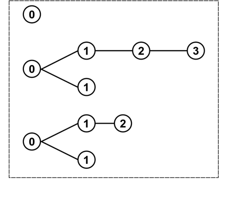

###### **Main contact for this notebook: Joe Hilton (j.hilton@warwick.ac.uk)**
<br>

This notebook requires the `pracma` package. If you do not have this package installed, uncomment and run this block of code:

```{r}
#install.packages("pracma",repos='http://cran.us.r-project.org')
```

If you already have `pracma` installed, run this block:

```{r}
library(pracma)
```

This next block makes sure all the plots we produce are a manageable size:

```{r}
options(repr.plot.width=5, repr.plot.height=5)
```

### 1. Course context

**Purpose and scope of the course**

This material has been developed as part of the *GeMVi* project: *NIHR Global Health Research Group on the Application of Genomics and Modelling to the Control of Virus Pathogens* in East Africa and the University of Warwick.

In these workshops you will be introduced to some common techniques used in infectious disease modelling. The topics covered will include the implementation of deterministic and stochastic compartmental models, the use of maximum likelihood estimation to analyse super-spreading behaviour in novel disease outbreaks, modelling of contact patterns, and optimisation techniques for fitting epidemic models to real data.

**Contributors**

The contributors are all part of the GeMVi project:

- Prof. James Nokes (JNokes@kemri-wellcome.org)
- Prof. Matt Keeling (m.j.keeling@warwick.ac.uk)
- Dr. Joe Hilton (j.hilton@warwick.ac.uk)
- Dr. Rabia Aziza (rabia.aziza@warwick.ac.uk)
- Dr. Samuel Brand (s.brand@warwick.ac.uk)
- Dr. Andrea Parisi (andrea.parisi@warwick.ac.uk)

**Helpful references for the course**

- Anderson, R. M., & May, R. M. (1992). Infectious Diseases of Humans: Dynamics and Control.
- Bjørnstad, O. N. (2018). Epidemics, models and data using R. https://doi.org/10.1007/978-3-319-97487-3
- Diekmann, O., & Heesterbeek, J. A. P. (2000). Mathematical epidemiology of infectious diseases: model building, analysis and interpretation. 104: John Wiley and Sons.
- Keeling, Matt J., & Pejman Rohani. Modeling Infectious Diseases in Humans and Animals. Princeton University Press, 2008.
- Vynnycky, Emilia, & White, Richard G. An Introduction to Infectious Disease Modelling

<br>

### 2. Introduction

In this notebook, we will introduce the basics of parameter estimation using **maximum likelihood estimation** (MLE). We will look at an application concerning the early stages of an outbreak of infectious disease, but the concepts you will encounter in this notebook are important to mathematical modelling in general. The content of this notebook is based on Lloyd-Smith *et al.*'s 2005 Paper [Superspreading and the effect of individual variation on disease emergence](https://www.nature.com/articles/nature04153). The notebook is designed to be self-contained, but if you would like to read the paper and are unable to access it, let one of the coordinators at Warwick know.

**Transmission chain data**

Given detailed information about the early stages of an outbreak, it is sometimes possible to reconstruct the specific person-to-person transmission events which make up the outbreak. This information could be in the form of genomic sequences, or in the form of observation data tracking contacts between cases. The list of transmission events lets us construct a **transmission chain** mapping the spread of the outbreak:

<center>  <center>

The early spread of the infection is characterised by the degree distribution of this tree - that is, the number of secondary cases generated by each case. As the epidemic progresses and the level of immunity in the population increases, this distribution will change, and the average number of secondary cases will decrease with each generation. For the first few generations of spread, however, the level of immunity will remain low and so we can treat the distribution of secondary cases as fixed. In this regime, we can think about the degree distribution of the first few generations of spread. The mean of the degree distribution is the average number of secondary cases generated per case, which is one definition of the **basic reproductive** ratio, denoted $R_0$.

In the following block of code, we define a vector `sars_data`, containing the frequencies of secondary case numbers in an outbreak of SARS which took place in Singapore in 2003 (see https://www.cdc.gov/mmwr/preview/mmwrhtml/mm5218a1.htm). Plotting the data in a histogram shows that the majority of cases generate no secondary cases, while a few cases are responsible for the majority of the spread. Note that we have binned the data into `max(sars_data)+1` bins since the first (and most full) bin contains all the cases which failed to generate any secondary cases.

```{r}
sars_data<-c(rep(0,162),rep(1,19),rep(2,8),rep(3,7),7,12,21,23,40)
hist(sars_data,breaks=seq(-0.5,max(sars_data)+0.5),ylim=c(0,200),col='blue',xlab='Secondary cases generated',ylab='Frequency',main='Secondary case distribution of SARS in Singapore, 2003')
```

### 3. The Poisson model

Given a transmission chain, we would like to develop a mathematical model which we can use to analyse the dynamics of the outbreak. Suppose that each case is infectious for a fixed period $\gamma$ and randomly generates new infections at a constant rate $\tau$ during this period. This is possibly the simplest model of a transmission process that one can define, and the resulting secondary case distribution will be Poisson distributed with mean $\lambda=\tau/\gamma$. This mean is the basic reproductive ratio, so $\lambda=R_0$. The purpose of a model is to understand the processes which generate our data, and to make predictions about the future behaviour of our system. In our situation, we would like to know the probability that a given case generates $x$ further cases, which under the Poisson model with parameter $\lambda$ is given by
$$
P(x|\lambda)=\frac{e^{-\lambda}\lambda^x}{x!}.
$$
This formula should allow us to predict the future course of the epidemic - except for the fact that we don't know what value of $\lambda$ to use! To solve this problem we need to fit $\lambda$ to the data by finding the value which is most consistent with it. To do this, we define a *likelihood* function. This tells us the probability that a certain parameter value generated our data:
$$
L(\lambda|\mathbf{x})=P(\mathbf{x}|\lambda).
$$
Here $\mathbf{x}$ is just the set of secondary case counts stored in the vector `sars_data`. The idea behind maximum likelihood estimation is that the "best" value for our parameter $\lambda$ should be the one that assigns the highest probability to our data $\mathbf{x}$. We refer to this value as the *maximum likelihood estimate* for $\lambda$ and denote it $\hat{\lambda}$. The acronym "MLE" is commonly used both for the maximum likelihood estimate and for the method, maximum likelihood estimation. In the examples in this notebook, we will assume that all of our data points are independent.This means that the joint probability of the entire dataset is the product of the probabilities of each data point, so
$$
L(\lambda|\mathbf{x}) = \prod\limits_iP(x_i|\lambda).
$$

Before we estimate $\lambda$, use the box below to plot the Poisson probability mass function `dpois(x,lambda)` with `x=sars_data` for a range of $\lambda$ values (you should find that ranging from 0 to 2 is sufficient to understand what is going on here). The `dpois` function applied to `sars_data` and a specific $\lambda$ value will output a vector containing the probability of each data point in `sars_data` given that $\lambda$ value, so to get the joint probability of the entire dataset you will need to use R's `prod` function to get the product of all the elements in this vector.

```{r}
#SOLUTION

lambda_range<-seq(from=0,to=2,by=0.001)
likelihood<-numeric(length(lambda_range))
for (i in 1:length(lambda_range)){
    likelihood[i]<-prod(dpois(sars_data,lambda_range[i]))
}
plot(lambda_range,likelihood,type='l',col='blue',lwd=5,xlab='lambda',ylab='Likelihood',main='Poisson parameter likelihood')
```

The curve you have just plotted is called the **likelihood surface** corresponding to the specific combination of model and data. In this case our "surface" is a line, but for models with more than one parameter the equivalent shape will indeed be a surface. The value of $\lambda$ at the curve's peak is the MLE, since this is where the likelihood is highest. The likelihood values are all extremely small, since they are obtained by taking the product of roughly 200 probabilities. Working with the product of lots of small numbers introduces the potential for serious numerical errors, and so we usually work with **log likelihood** instead of the likelihood. For the Poisson model, using log likelihood converts the product
$$
L(\lambda|\mathbf{x})=P(\mathbf{x}|\lambda)=\prod\limits_{i=1}^n\frac{e^{-\lambda}\lambda^x_i}{x_i!}
$$
into the sum
\begin{align}
\log(L(\lambda|\mathbf{x}))=&\sum\limits_{i=1}^n\log((\frac{e^{-\lambda}\lambda^x_i}{x_i!}))\\
=&\sum\limits_{i=1}^n-\lambda+x_i\log(\lambda) -log(x_i!).
\end{align}
This expression is much more numerically stable than the likelihood function. Since the logarithm function is a diffeomorphism (i.e. it preserves the sign of a function it is composed with), the log likelihood will have a maximum at the same point as the likelihood, so that finding the maximum of $\log(L(\lambda|\mathbf{x}))$ gives us the MLE.

The likelihood surface has a single peak between $\lambda=0.5$ and $\lambda=1$. This tells us that the MLE exists, and should be reasonably easy to find. In the box below, we define functions `poi_log_lh`, which calculates the log likelihood of the Poisson parameter $\lambda$ given data $\mathbf{x}$, and `get_poi_mle`, which estimates the maximum likelihood parameter $\hat{\lambda}$, and carry out this estimation for our SARS example.

```{r}
poi_log_lh <- function(lambda,data) {
    l<-0
    l=l+sum(log(dpois(data,lambda)))
    return(l)
}

# In the following function, lambda_minmax is a vector containing the range over which we will search for the MLE
get_poi_mle <- function(data,lambda_minmax) {
    f <- function(lambda) {
        return(poi_log_lh(lambda,data))
    }
    lambda_mle <- as.numeric(optimise(f,lambda_minmax,maximum=TRUE)[1])
    return(lambda_mle)
}

lambda_mle = get_poi_mle(sars_data,c(0,max(sars_data)))

cat("MLE is ",lambda_mle,".")
```

Our function successfully finds the peak indicated by the likelihood surface. In fact, we went to far more effort than was necessary to find it. If you calculate `mean(sars_data)`, you will find that it returns precisely the MLE which we just calculated! One can show without too much effort that the log likelihood function $L(\lambda|\mathbf{x})$ always has a maximum when $\lambda=\frac{1}{n}\sum_ix_i$. This means that the MLE of the Poisson distribution's mean is always given by the sample mean. In fact, this holds true for all the distributions we will encounter today, and in general for a broad class of distributions known as *exponential families*. Note that this is **not** true of model parameters in general; as we will see later, for some models the variance given by the maximum likelihood parameters is not necessarily equal to the sample variance.

**Confidence intervals**

In practice, simply quoting the MLE for a parameter is not usually sufficient since it does not tell us how confident our choice is. If the likelihood surface is very flat, then there may be lots of parameter values which achieve a likelihood very close to the maximum, corresponding to very different qualitative behaviours. For this reason, we usually quote a *confidence interval* alongside any inferred parameter. Confidence intervals are much more challenging to compute than MLEs, and even the definition is a little tricky; one commonly used definition for real-valued parameters is that the confidence interval $[a,b]$ to a confidence level $p$ is the range of values such that whenever we draw a sample of our random variable and infer the parameter, there is probability $p$ that the inferred parameter is in the range $[a,b]$. Typical values of $p$ include 90%, 95%, and 99%. We will not carry out confidence interval calculations in this notebook, although Wikipedia covers the analytical calculation of Poisson confidence intervals: https://en.wikipedia.org/wiki/Poisson_distribution#Confidence_interval.

Let's recap what we've done so far: We have proposed a one-parameter model for our data, the Poisson distribution, based on a simple mechanistic principle, and estimated a value for its parameter by maximising the log likelihood of that parameter. How well does our model do at describing the data?

Let's try plotting the fitted Poisson distribution over the empirical distribution from the SARS data:

```{r}
hist(sars_data, breaks=seq(-0.5,max(sars_data)+0.5), probability = TRUE, border='blue',xlab='Secondary cases generated',ylab='Probability',main='Secondary case distribution of SARS in Singapore, 2003')
points(seq(0,max(sars_data),1),dpois(seq(0,max(sars_data),1),lambda_mle), pch=19, col = 'red')
legend('topright',legend=c('Data','Poisson model'),col=c('blue','red'),pch=c(0,19))
```

It should be immediately clear that our Poisson distribution has done a poor job of capturing the features of this data. Running the box below, you will see that the variance of our data is substantially higher than the mean:

```{r}
var(sars_data)
```

**Overdispersion and superspreaders**

Count data with a higher variance than mean is described as *overdispersed*, meaning the data is much more spread out than would be predicted by a Poisson model (recall that the Poisson distribution has a variance equal to its mean). Our SARS dataset is overdispersed because it contains a large number of individuals who produce no secondary cases, along with a few cases who produce a very large number of secondary cases. These highly prolific individuals are often referred to as *superspreaders*. In Lloyd-Smith *et al.*'s paper, they define superspreaders to be those cases which would fall in the 99th percentile of a Poisson distribution with mean $\bar{x}$. In the box below, use the `qpois` function to calculate the upper 99th percentile of a Poisson distribution with parameter `mean(sars_data)`, and then write a function which takes a set of transmission chain data as an input and then returns the list of superspreaders from that dataset.

```{r}
#SOLUTION

qpois(.99,mean(sars_data))

identify_superspreaders <- function(data) {
    lambda<-mean(data)
    superspreaders<-data[data>qpois(.99,lambda)]
    return(superspreaders)
}

identify_superspreaders(sars_data)
```

You should find that the superspreaders in the SARS dataset are those individuals who generated 7, 12, 21, 24, and 40 secondary infections. Under the Poisson model, we assumed that all individuals in the dataset had the same infectious period and contact rate. The presence of superspreaders in the data suggests that this is a poor assumption - the individual who generated 40 cases is likely to have behaved very differently to the individual who generated 23 cases, who is in turn likely to have behaved very differently to the 162 individuals who generated no cases at all.

### 4. The negative binomial model

In this section we introduce the **negative binomial model** for infectious disease transmission. One definition of the negative binomial distribution is "a Gamma-Poisson mixture": to draw a random variable from the negative binomial distribution with parameters $(\lambda,k)$, first draw a random variable $\nu$ from a gamma distribution with mean $\lambda$ (we choose this notation for consistency with the mean of the Poisson distribution) and dispersion (or shape) parameter $k$ and then draw from a Poisson distribution with mean $\nu$. From an epidemiological perspective, we are saying that each individual's infectivity (their infectious period multiplied by the rate at which they generate cases) is drawn from the gamma distribution with parameters $(\lambda,k)$, and then the individual generates cases according to this infectivity. The value of the random variable $\nu$ for a specific case is the **individual-level reproductive ratio**, the expected number of secondary cases generated by that specific case. Letting the individual-level reproductive ratio vary from case to case allows for individual-level variation which has the potential to capture superspreading behaviour.

The negative binomial distribution has mean $\lambda$ (the mean of the underlying gamma distribution) and variance $\lambda(1 + \lambda/k)$. The variance-to-mean ratio is then $1+\lambda/k$, so the negative binomial distribution is always overdispersed, with the level of overdispersion increasing as $k$ decreases.

When $k=1$, the negative binomial is identical to the geometric distribution, which has a variance-to-mean ratio of $1+\lambda$. The geometric distribution can be obtained as a Poisson distribution with exponentially-distributed mean. In the standard stochastic SIR model, cases are infectious for exponentially-distributed periods and make contacts at the points of a Poisson process, so that the geometric distribution describes the distribution of secondary cases in this commonly-used model.

In R (and many other scientific programming languages), a slightly different parameterisation of the gamma and negative binomial distributions are used. The pmf of the negative binomial distribution is calculated using the function `dnbinom(x,k,p)`. We can translate from our parameterisation to the one underlying this function using the formula $p=1-\lambda/(\lambda+k)$.

Use the next box to write a function `nb_log_lh(lambda,k,data)` which uses the function `dnbinom` with arguments `(x,k,1-lambda/(lambda+k))` to calculate the log likelihood of a set of negative binomial parameters. Hint: it should have the same structure as the function `poi_log_lh` we introduced earlier!

```{r}
#SOLUTION

nb_log_lh <- function(lambda,k,data) {
    l<-0
    for (x in  data) {
        l=l+log(dnbinom(x,k,1-lambda/(lambda+k)))
    }
    return(l)
}
```

If your function `nb_log_lh` correctly calculates the log likelihood of the parameters $\lambda$ and $k$, then the following function `get_nb_mle` will find the maximum likelihood estimates of the parameters given a dataset:

```{r}
get_nb_mle <- function(data,k_minmax) {
    lambda_mle<-mean(data)
    f <- function(k) {
        return(nb_log_lh(lambda_mle,k,data))
    }
    k_mle<-as.numeric(optimise(f,k_minmax,maximum=TRUE)[1])
    return(c(lambda_mle,k_mle))
}
```

Try using the function to find the maximum likelihood estimates. You should find that $\hat{\lambda}=0.791$ and $\hat{k}=0.093$. Because the MLE of $\lambda$ is the same for the Poisson and negative binomial models, you can overwrite the value of `lambda_mle` which we calculated for the Poisson distribution.

```{r}
#SOLUTION

mles = get_nb_mle(sars_data,c(0,max(sars_data)))
lambda_mle = mles[1]
k_mle = mles[2]
cat("MLEs are lambda = ",lambda_mle,", k = ",k_mle,".")
```

Plotting the fitted Poisson and negative binomial models over the data shows that the negative binomial attains a substantially better fit:

```{r}
hist(sars_data, breaks=seq(-0.5,max(sars_data)+0.5), probability = TRUE, border='blue',xlab='Secondary cases generated',ylab='Probability',main='Secondary case distribution of SARS in Singapore, 2003')
points(seq(0,max(sars_data),1),dpois(seq(0,max(sars_data),1),mean(sars_data)), pch=19, col = 'red')
points(seq(0,max(sars_data),1),dnbinom(seq(0,max(sars_data),1),k_mle,1-lambda_mle/(lambda_mle+k_mle)), pch=19, col = 'green')
legend('topright',legend=c('Data','Poisson model','Negative binomial model'),pch=c(15,19,19),col=c('blue','red','green'))
```

### 5. Goodness of fit

**Akaike Information Criterion**

The plot above suggests that the negative binomial distribution offers a much better description of the SARS outbreak data than the Poisson distribution. In this section we introduce a more formal way to assess which model is best. The **Akaike Information Criterion** (AIC) for a model with MLE parameters $\hat{\mathbf{\theta}}$ (note that for a multi-parameter model $\hat{\mathbf{\theta}}$ is a *vector* containing all the parameters) given the data $\mathbf{x}$ is given by the following formula:
$$
AIC=2K-2\log{L(\hat{\mathbf{\theta}}|\mathbf{x})}.
$$
Here $K$ is the number of model parameters, i.e. the length of the vector $\mathbf{\theta}$. The AIC weighs the number of parameters used in the model against its ability to model the data, measured by the log likelihood. In general a model with a smaller AIC is considered to give a better fit than one with a larger AIC. The factor of $2K$ helps us to avoid models which \emph{overfit} to a dataset. If two models give the same log likelihood using different numbers of parameters, AIC suggests we should choose the one with fewer parameters. While we can always achieve a close fit to data by adding lots of parameters to a model, this can lead to **overfitting**, where the model captures lots of very specific features of the sample data rather than capturing the general features of the process generating the data. This makes an overfitted model very good at *describing* the data it is fit to, but very bad at *predicting* new datapoints.

In the box below, use the functions `poi_log_lh` and `nb_log_lh` to calculate the AIC for the Poisson and negative binomial models. You should find that the negative binomial model achieves a much lower AIC than the Poisson model.

```{r}
# SOLUTION
cat("AIC for Poisson model is ",2-2*poi_log_lh(lambda_mle,sars_data),".")
cat("AIC for negative binomial model is ",4-2*nb_log_lh(lambda_mle,k_mle,sars_data),".")

```

**The likelihood ratio test**

We can perform a hypothesis test comparing two models using the **likelihood ratio test**. Suppose we have a data set $\mathbf{x}$ and two hypotheses:

* $H_0$: the data is explained by a model with a parameter vector $\theta_0$ (we call this the *null model**);
* $H_1$: the data is explained by some other model with a parameter vector $\theta_1$.

One requirement of the likelihood ratio test is that the models be "nested", in the sense that the model from $H_0$ is a special case of the model from $H_1$. In practice this usually means we can choose parameter values for the model in $H_1$ which give us the model from $H_0$. While this special case may be more simple and require fewer parameters than the $H_1$ model, it will pay a penalty in its ability to capture the data we are interested in. We test hypothesis $H_1$ against the null hypothesis $H_0$ by comparing the ratio of their maximum likelihoods against some significance level. If the models have likelihood functions $L_0$ and $L_1$ and parameter MLEs $\hat{\mathbf{\theta}}_0$ and $\hat{\mathbf{\theta}}_1$ this ratio is
$$
\frac{L_0(\hat{\mathbf{\theta}}_0|\mathbf{x})}{L_1(\hat{\mathbf{\theta}}_1|\mathbf{x})}.
$$
If this ratio is less than the chosen significance level, we reject the null hypothesis. The likelihood ratio will always be between zero and one because the model from $H_0$ is a special case of the model from $H_1$, so that we can always obtain the null model by choosing specific parameters in the alternative model. This means that the maximum likelihood obtained under $H_1$ is greater than or equal to that obtained under $H_0$, because we can always pick parameters under $H_1$ which give us the $H_0$ model and the corresponding likelihood. A small likelihood ratio means that the likelihood we can obtain under the null model is much smaller than the likelihood we can obtain under the $H_1$ model.

In our example, $H_0$ is that the data is Poisson distributed, while $H_1$ is that the data is negative binomially distributed. Under the $(\lambda,k)$ parameterisation of the negative binomial model, we obtain the Poisson model in the limit $k\to\infty$; although this might not look like the Poisson is strictly a subcase of the negative binomial, there are alternative parameterisations of the negative binomial (for instance using $p=1/k$ in place of $k$) for which the Poisson is within, rather than at a limit of, parameter space. Saying the data is negative binomially distributed is a more general statement than saying is is Poisson distributed; a Poisson-distributed random variable is also negative binomially distributed, but only some negative binomially distributed random variables are also Poisson-distributed. In the cell below, perform a likelihood ratio test comparing the Poisson and negative binomial models using the parameter MLEs we have already calculated to see if we should reject the hypothesis that the SARS data is Poisson distributed at a five percent significance level. Remember that you need to compare the likelihoods rather than the log likelihoods.
```{r} 
# SOLUTION
cat('Likelihood ratio is',exp(poi_log_lh(lambda_mle,sars_data)-nb_log_lh(lambda_mle,k_mle,sars_data)),'.')
```
You should find that the test **very** firmly supports rejecting the Poisson model! The likelihood ratio test gives us a formal method for deciding whether to reject a simpler, more specific model by comparing it to a more general but also more complex one. As always with hypothesis testing, it is important to remember that rejecting $H_0$ does not mean we accept $H_1$. In our SARS data example, although we have rejected a Poisson model, we could still potentially find other models with more parameters that can obtain higer likelihoods than the negative binomial model.


### 6. Proportional contributions of cases

The negative binomial distribution can achieve a close fit to epidemiological count data because it allows for natural variation in individual-level infectivity, which may be the result in differences in social behaviour (i.e. more gregarious versus less gregarious individuals) or in physiological response to infection (i.e. severe disease with lots of coughing/sneezing versus asymptomatic cases with little or no shedding). This variation is captured by a gamma distribution. Plotting this gamma distribution can give us an indication of how infectivity is distributed, but it is more interesting to plot the proportion of cases which give rise to a proportion of infection. Suppose that the majority of infection could be traced to a small number of cases. If we could identify these cases, then targetting control measures towards them would be a more effective intervention than targetting the entire population equally. The specific example where 80% of infections can be traced to the 20% of cases who are most infectious is an example of the [Pareto principle](en.wikipedia.org/wiki/Pareto_principle) or "80-20 rule", which states that for many common phenomena 20% of causes are responsible for 80% of effects.

Recall that we used $\nu$ to denote the individual-level reproductive ratio, the expected number of cases a case generates. For each case, $\nu$ is drawn from a gamma distribution with probability density function $f(\nu|\lambda,k)$. Let $F_{\mathrm{Trans}}(y|\lambda,k)$ denote the proportion of all cases generated by cases with $\nu\leq y$, given the parameters $(\lambda,k)$. This proportion should be directly proportional to $\int\limits_0^yuf(u|\lambda,k)\mathrm{d}u$, since the expression inside the integral is just the number of cases generated by each individual with $\nu=u$ weighted by the proportion of such individuals in the set of all cases. Observing that when $y=\infty$ this integral gives the expectation of the gamma distribution, the appropriate constant of proportionality is given by $1/\lambda$. Thus,
$$
F_{\mathrm{Trans}}(y|\lambda,k)=\frac{1}{\lambda}\int\limits_0^yuf(u|\lambda,k)\mathrm{d}u.
$$
If you evaluate this analytically, you will find that
$$
F_{\mathrm{Trans}}(y|\lambda,k)=\frac{\gamma(\frac{k}{\lambda}x,k+1)}{\Gamma(k+1)},
$$
where $\gamma(.,.)$ is the (lower) incomplete gamma function and $\Gamma(.)$ is the gamma function. The ratio between the two is the \emph{regularised gamma function}. The `pracma` R package contains a function `gammainc` which evaluates the regularised gamma function. `gammainc` outputs a column vector whose first two entries are the lower and upper incomplete gamma functions and whose third is the regularised gamma function. Thus, to calculate $F_{\mathrm{Trans}}(y|\lambda,k)$, we need to call `gammainc(y*k/lambda,k+1)[3]`.

In the box below, write a function `transmission_proportion(y,lambda,k)` which calculates $F_{\mathrm{Trans}}(y|\lambda,k)$ for a vector of $y$ values.

```{r}
#SOLUTION

transmission_proportion <- function(x,lambda,k) {
    F<-numeric(length(x))
    for (i in 1:length(x)){
        F[i]=gammainc(x[i]*k/lambda,k+1)[3]
    }
    return(F)
}
```

The proportion of infections generated by individuals with $\nu>y$ is given by $1-F_{\mathrm{Trans}}(y)$, and the proportion of individuals with $\nu>y$ is given by $1-F_{\nu}(y)$, where $F_{\nu}(y)=\int\limits_0^yf(u|\lambda,k)\mathrm{d}u$ is the CDF of $\nu$. In the box below, we plot $1-F_{\mathrm{Trans}}$ against $1-F_{\nu}$. If your function `transmission_proportion` works correctly, your plot should look something like an upside-down 'L' shape, with almost all the infection generated by a tiny proportion of cases - clear evidence of a superpreading effect!

```{r}
# SOLUTION
val_range=seq(from=0.01,to=20.0,by=0.01)
F_trans=transmission_proportion(val_range,lambda_mle,k_mle)
F_nu=pgamma(val_range, shape=k_mle, scale=1-lambda_mle/(lambda_mle+k_mle)) # pgamma calculates the CDF of the gamma distribution
plot(1-F_nu,1-F_trans,,type='l',col='blue',lwd=5,xlab='Proportion of population',ylab='Proportion of cases generated',main='Proportional contribution to epidemic of most infectious cases')
```

### 7. Summary

In this notebook we have used transmission chain data to introduce some basic concepts around parameter fitting in infectious disease modelling.Our main conclusions are:

* Likelihood is a measure of how well a model describes a dataset given some parameters
* Maximum likelihood estimation is a method for finding the best values for a set of parameters, in terms of goodness of fit
* The MLE for the mean of a Poisson distribution is always the sample mean; this is true of many, but by no means all, commonly used distributions
* Secondary case distributions are typically overdispersed, with a variance larger than the mean; this is usually due to a large number of zeros in the dataset and a few superspreaders who generate large numbers of cases
* The negative binomial distribution can model overdispersed count data using two parameters
* The Akaike Information Criterion measures a model's goodness of fit by weighing the maximum likelihood achieved against the number of parameters used to achieve this fit
* More general models can be compared against specific cases using the likelihood ratio test
* In the negative binomial model we can identify the relative contributions to an outbreak of the most and least infectious cases.