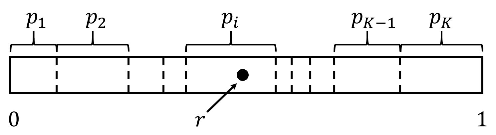

###### **Main contact for this notebook: Dr. Rabia Aziza (rabia.aziza@warwick.ac.uk)**
<br>

### 1. Course context

**Purpose and scope of the course**

This material has been developed as part of the *GeMVi* project: *NIHR Global Health Research Group on the Application of Genomics and Modelling to the Control of Virus Pathogens* in East Africa and the University of Warwick.

In these workshops you will be introduced to some common techniques used in infectious disease modelling. The topics covered will include the implementation of deterministic and stochastic compartmental models, the use of maximum likelihood estimation to analyse super-spreading behaviour in novel disease outbreaks, modelling of contact patterns, and optimisation techniques for fitting epidemic models to real data.

**Contributors**

The contributors are all part of the GeMVi project:

- Prof. James Nokes (JNokes@kemri-wellcome.org)
- Prof. Matt Keeling (m.j.keeling@warwick.ac.uk)
- Dr. Joe Hilton (j.hilton@warwick.ac.uk)
- Dr. Rabia Aziza (rabia.aziza@warwick.ac.uk)
- Dr. Samuel Brand (s.brand@warwick.ac.uk)
- Dr. Andrea Parisi (andrea.parisi@warwick.ac.uk)

**Helpful references for the course**

- Anderson, R. M., & May, R. M. (1992). Infectious Diseases of Humans: Dynamics and Control.
- Bjørnstad, O. N. (2018). Epidemics, models and data using R. https://doi.org/10.1007/978-3-319-97487-3
- Diekmann, O., & Heesterbeek, J. A. P. (2000). Mathematical epidemiology of infectious diseases: model building, analysis and interpretation. 104: John Wiley and Sons.
- Keeling, Matt J., & Pejman Rohani. Modeling Infectious Diseases in Humans and Animals. Princeton University Press, 2008.
- Vynnycky, Emilia, & White, Richard G. An Introduction to Infectious Disease Modelling


<br>

### 2. Introductory example

In our first workshop we introduced deterministic compartmental models of infectious disease dynamics. In this one we turn our attention to stochastic models. A *stochastic process* is a process which evolves at random according to a set of rules. There are various different types of stochastic process, although in this workshop we will focus on *continuous time Markov chains*. As the name suggests, these processes have two defining characteristics:
* they evolve in continuous time, as opposed to on a discrete step-by-step basis;
* they satisfy the Markov property: the evolution of the system depends only on its current state.
We will illustrate these characteristics using a simple example.

To begin with, let's think about a *mortality process* describing a population of individuals who die at a fixed per-capita death rate $\mu$. We typically define continous-time Markov chains by listing a set of events and the rates at which they occur. For this reason continuous-time Markov chain models are often called *event-based* models. Using $N(t)$ to denote the population size at time $t$, our model is defined by the following event-rate pair:
$$
N(t)\to N(t)-1 \text{ at rate } \mu N(t).
$$
There are no other events in this process. We can see that the mortality process satisfies the Markov property because the rate depends only on the current state of the system, $N(t)$; if the death event $N(t)\to N(t)-1$ occured at rate $\mu N(t-1)$ then the Markov property would no longer be satisfied as the rate would no longer depend only on the current state of the system. We can clean up our notation by supressing the dependence on time:
$$
N\to N-1 \text{ at rate } \mu N.
$$
It is reasonably easy to see that if we interpret our rate as describing a deterministic flow, we will get the following differential equation:
$$
\frac{\mathrm{d}N}{\mathrm{d}t} = - \mu N.
$$

This integrates to give the solution $N(t)=N(0)\exp(-\mu t)$, which we plot in the following cell with parameter value $\mu=0.05$ and initial condition $N_0=10$:

```{r}
mu = 0.05
N = 100
times = seq(0,50,1)   #max time = 50 and time step = 1
ts <- data.frame(time = times,populationSize = N * exp(-mu*times))

plot(ts$time,ts$populationSize,type='l',ylim=c(0,N),xlim=c(0,50),ylab='Population size',xlab='Time')
```

This interpretation of our process feels slightly unsatisfying; over nearly all of time period we have plotted, the population size is not an integer. One of the benefits of stochastic modelling is that we can work in continuous time but stick to a discrete integer state space.

There are two ingredients to a continuous-time stochastic process: the events which change the state of the system, and the time at which these events occur. There is only a single event in our process; we know that from state $N$ the only possible event is $(N\to N-1)$. Denote by $t_n$ the time at which the $n$th death event happens, with $t_0=0$, and let $\delta t_n=t_n-t_{n-1}$. Recall that the Markov property states that the rate at which events occur depends only on the state of the system, $N=N_0-(n-1)$, and in particular the distribution of $\delta t_N$ needs to be independent of time. This means that the distribution of $\delta t_N$ needs to be *memoryless*, so that it satisfies the following property:
$$
\mathbb{P}(\delta t_n>t+s|\delta t_N>t) = \mathbb{P}(\delta t_n>s).
$$
What this says is that the probability that the event takes at least $s$ units of time to occur does not change over time. For example, if on day 0 there is a 50% chance that an individual dies within the next five days, under an exponential distribution if they do not die on day 0 then on day 1 there will still be a 50% chance that they die in the next five days. The only continuous probability distribution which satisfies this condition is the exponential distribution. The expectation of this distribution is the reciprocal of the rate at which the event occurs, and so the distribution of the inter-event distribution is given by
$$
\mathbb{P}(\delta t_n) = \frac{1}{\mu N}\exp(-\delta t_n/(\mu N)).
$$
So, to implement the stochastic mortality process we keep drawing inter-event times from a sequence of exponential distributions until the population size reaches zero. In the following cell we generate a realisation of the mortality process by drawing event times in sequence and attaching them to a sequence of population sizes $(10,9,8,...,0)$.
```{r}
deathTimes <- list(0) 
popData <- list(N) 
populationSize <- N 
t <- 0 
while(populationSize>0){ 
    dt <- rexp(1,mu*populationSize) 
    t <- t + dt 
    populationSize <- populationSize - 1 
    deathTimes <- c(deathTimes, t) 
    popData <- c(popData, populationSize) 
} 
```
##### *$\rightarrow$Try it yourself*

In the cell below, try plotting the solution to the differential equations and the realisation of the stochastic process on the same axes.
```{r}
##

#
```

As you can see, the two implementations of the mortality process give similar results. If you try running the stochastic implementation again and re-plotting the results, you will see tha although the results are different every time, they remain close to the deterministic model's predictions.


<br>

### 3. Gillespie method

The Gillespie algorithm *(Gillespie, 1977)* was originally developed to simulate the dynamics of chemical reactions. It generalises the basic principles behind the implementation of the mortality process we outlined above to allow for systems with multiple event-rate pairs. Such a system is summarised by a state $X$ and a set of $K$ events which occur at rates $r_1(X),...,r_K(X)$. Each event acts to alter the state of the system, so we can summarise the $i$th event-rate pair as
$$
X\to X' \text{ at rate } r_i(X),
$$
where $X'$ is the state of the system after event $i$ has been implemented. Once the event is implemented, the event rates are updated from $r_1(X),...,r_K(X)$ to $r_1(X'),...,r_K(X')$. In what follows we usually suppress the dependence of the rates on the state, writing $r_1,...,r_K$ instead of $r_1(X),...,r_K(X)$. Because of the Markov property, the dependence is only on the current state and so this notation is unambiguous. Note that in practice the state space $X$ can by a vector. In the SIR model, for instance, we have $X=(S,I,R)$.

In our mortality process example, we drew an exponential "time to next death event" and then implemented that event. This was fairly simple since each death had an identical effect on the population. The Gillespie algorithm adapts this to more complex settings by drawing a general "time to next event" and then deciding exactly what that event is and what impact it will have on the population. To see how this can be done, observe that if we have $K$ events occurring independently at rates $r_1,...,r_K$, the total rate at which an event occurs is
$$
\sum\limits_{i=1}^Kr_i.
$$
The assumption that the events occur independently comes from the Markov property - if event $i$ is more likely to happen after event $j$ has happened than after event $k$ has happened, then the rates are not fully determined by the current system state and so our system is not a Markov chain. Based on this total rate, the time to the $n$th event is distributed exponentialy with probability density function
$$
\delta t_n = \frac{1}{\sum_i r_i}\exp(-\delta t_n/\sum_i r_i).
$$
This gives us a way to choose event times in a stochastic simulation, but it still doesn't tell us how to choose the events themselves. We start by noting that each event-rate pair defines a *Poisson process*. This is just a stochastic process where events happen at a fixed rate in continuous time. We will not go through the working here, but one can show that based on the properties of Poisson processes, the probability that the first event to occur is event $i$ is equal to the size of rate $r_i$ relative to the rest of the rates. Thus, denoting by $p_i$ the probability that we choose event $i$ to occur at time $t_{n-1}+\delta t_n$, we have
$$
p_i = \frac{r_i}{\sum_j r_j}.
$$
This gives us a distribution which we can use to choose our events. To draw from this distribution, we generate a uniformly distributed random variable $r\in (0,1)$. Since the probabilities $p_1,...,p_K$ sum to $1$, we know that there must exist exactly one $i$ such that
$$
\sum\limits_{j=0}^{i-1} p_j < r < \sum\limits_{j=0}^ip_j.
$$
Choosing the event $i$ which satisfies this inequality gives us the appropriate distribution. The following diagram illustrates the event-choosing process:

<center>  </center>

A line of unit length is divided into sections of length $p_1,...,p_K$. Drawing a uniform random variable on $(0,1)$ is the equivalent of placing a point on the unit line, and our event-choosing method simply checks where on that unit line we have placed the point.

Based on this reasoning, we can write down the following algorithm for simulating a continuous-time Markov chain model: 

<br>

**Gillespie algorithm (W1, W2)**

1. <b>Initialization:</b> Choose an initial state $X_0$ and intial time $t_0$, define a simulation duration $T$, and seed a random number generator (in R this latter step is done automatically).
2. <b>Monte Carlo step:</b> Calculate a set of rates $r_1,...,r_K$ based on the current system state $X_n$. Draw a uniform $[0,1]$ random variable $r$ and an exponential random variable $\delta t_n$ with mean $1/sum_ir_i$.
3. <b>Update:</b> Set $t_{n+1} = t_n + \delta t_n$, and update the state $X_n\to X_{n+1}$ according to the effect of the $i$th event, where $\sum\limits_{j=0}^{i-1} p_j < r < \sum\limits_{j=0}^ip_j$.
4. <b>Iterate:</b> If $t_n>T$ or $\sum_i r_i=0$ end the simulation, otherwise return to step 2.

We will demonstrate how to implement this algorithm by simulating an SIR model without demography. The state of this model is given by $(S,I,R)$, and it has two event-rate pairs:
$$
(S,I,R)\to(S-1,I+1,R) \text{ at rate } \beta\frac{SI}{N},\text{ and}\\
(S,I,R)\to(S,I-1,R+1) \text{ at rate } \gamma I.
$$

**Initialization**

In the cell below we choose the initial conditions and duration of our simulation, and define the model parameters $\beta$ and $\gamma$. We will simulate an infection in a population of size 10,000 seeded by five index cases for a period of one year. The choice of $\gamma$ corresponds to a mean infectious period of two days, and the choice of $\beta$ gives us an $R_0$ of $1.2/0.5=2.4$.

```{r}
totalTime = 356.        # Total simulation time in days
N = 1e4                 # Population size
I0 = 5                  # Initial number of infecteds
beta =1.2               # Transmission rate
gamma = 0.5             # Recovery rate
```

In the next cell we declare the variables we need to track the time, the number of infecteds, the number or susceptibles, and the number of recovered individuals. These will update at each step of our simulation.

```{r}
t = 0                 # Current time
S = N - I0            # Current number of susceptibles
I = I0                # Current number of infecteds
R = 0                 # Current number of recovered individuals
```

Since we want to plot the evolutions of these variables, we store them in a dataframe (or lists, or arrays). We therefore prepare an empty dataframe to use as output of our model:

        df = data.frame()    # Output data (to be plotted later)


**Monte Carlo step**

In the next cell we set our rates based on the current state of the system, along with their sum.

        rate1 = beta*S*I/N
        rate2 = gamma*I
        rates = rate1 + rate2


Provided the total rate is non-zero, we draw the "time to next event" from an exponential distribution and update the current time accordingly:

        if (rates > 0) {
            t = t + rexp(1/rates, rate = 1)
        }

If the next event happens after the total duration of the simulation, or if we have no more infecteds in the system, then we stop the simulation:

        if (t > totalTime || rates == 0){
            break;
        }
        

**Update**

Now that we know when the next event will happen, we draw a uniform random variable and use the "divided line" method to choose whether we get an infection or a recovery event:

        if (runif(1) < (rate1/rates)){
            S = S - 1
            I = I + 1
        } else {
            I = I - 1
            R = R + 1
        }

We then store the new counts into the output dataframe that we prepared:

        df = rbind(df,data.frame(times=t,S=S,I=I,R=R))


**Iterate**

We now go back to step 2 and repeat the steps all over again, until we reach the end of the simulation. To do so, we envelope the previous snippets of code in a loop with the condition to keep repeating until the time t exceeds the total simulation time.

        while (t < totalTime){
            # step 1: initialing parameters and variables
            # step 2: monte carlo step
            # step 3: updating variables of the current state and outputs
            # step 4: looping in the while loop
            break # we add this break so that if you run the whole document, this loop won't iterate forever
        }

<br>

### Gillespie function

**Preparing the Gillespie function**

##### *$\rightarrow$Try it yourself*

We can combine the previous cells into a function that we call `Gillespie()`. 

```{r}
# Recalling the needed parameters
totalTime = 356*1.      # Total simulation time
N = 1e4                  # Population size
I0 = 5.                 # Initial number of infecteds
beta = 1.2               # Transmission rate
gamma = 0.5              # Recovery rate

# declaring the Gillespie function
Gillespie = function (){
    ####
    #
    #
    ####
}
```


**Plotting the results**

In the cell below we run a single implementation of our Gillespie simulation and plot the results. Note that when we call the function with empty parameters, it uses the default values set in the function's declaration.

```{r}
## call the function and store the results in lists
#results = Gillespie()

## plotting
#plot(results$times,results$S,type='s',col='blue',bty="n",ylab="Number of individuals",xlab="time",lwd=2,ylim=c(0,N))
#lines(results$times,results$I,type='s',col='red2',lwd=2)
#lines(results$times,results$R,type='s',col='green',lwd=2)
#legend(x="topright",c("S","I","R"),lty=1,col=c("blue","red2","green"),bty="n",lwd=2)
```


Try running the last snippet of code several times. Because the simulation is random, you will get a different result each time. There are two observations which we can make of the model's behaviour:

- Unlike in a deterministic model, where whenever $R_0>1$ the infection is able to "take off" and spread through the population, on some runs of the stochastic model the infection fails to take off and dies out quickly after generating a small number of infections. Stochastic extinction is an important feature of infectious disease dynamics which can not be captured by a deterministic model. This is an important insight when it comes to understanding real-world outbreaks. If we see a few cases of an infection followed by extinction, the deterministic framework tells us that $R_0$ is less than one and we should not expect any large outbreaks of that infection in the future, whereas the stochastic framework tells us that we could have just observed a random extinction of an infection with $R_0>1$ which could cause a large epidemic in the future. Without external imports of infection, any simulation of an epidemic in a finite population will eventually go extinct.

- Although the exact dynamics are unique, each simulation which does take off looks fairly similar. You can think of each realisation as a random variable drawn from a distribution tightly packed around the trajectory of the deterministic model.


**Multiple simulations**

Because each run of a stochastic simulation is different and represents a single sample from an infinitely large distribution of trajectories, it is important to perform multiple simulations in order to get a clearer idea of what this trajectory space looks like. Through repeat simulations we can estimate things like the expected number of cases up to a specific time, or the proportion of runs which die out before the end of the simulation.


##### *$\rightarrow$Try it yourself*

In the cell below, write a code which repeatedly calls the `Gillespie()` function over a for loop to execute and plot multiple sims of the stochastic epidemic.

```{r}
#


#
```


<br>

**Comparison with the deterministic SIR**

##### *$\rightarrow$Try it yourself*

Write a function implementing the deterministic SIR using the same parameters as the Gillespie Algorithm. Plot the results on the same axis as some realisations of the stochastic model and compare their behaviours.

```{r}
# Set the same parameters as the gillespie algo


# Write the DeterministicSIR function


# Solve and plot


#
```


<br>

##### *$\rightarrow$Try it yourself*

In the cell below, write a Gillespie algorithm simulation of the SEIR model without demography.
```{r}
##SEIR Gillespie


#
```


<br>

### 4. Gillespie SIRS with demography and seasonality

In this section, we add waning immunity, demography, and seasonality to the SIR model. With waning immunity, recovered individuals lose their immunity and transition from the $R$ compartment back to the $S$ compartment at a rate $\omega$. With this $R\to S $ transition, our SIR structure is replaced with a SIRS structure. As in our first workshop, we introduce two demographic events: birth at per-capita rate $B$ and death at per-capita rate $\mu$. Finally, we add seasonality, so that the person-to-person transmission rate is time-dependent. We will use the periodic function
$$
\beta(t)=\beta exp(\xi cos(2\pi (t-\phi)/365)).
$$
To avoid permanent extinction, we also add occasional imports of infection into the population at a rate $\epsilon$. With these considerations, we have the following event-rate pairs:
$$
(S,I,R)\to(S-1,I+1,R) \text{ at rate } \beta(t)\frac{SI}{N},\\
(S,I,R)\to(S,I-1,R+1) \text{ at rate } \gamma I,\\
(S,I,R)\to(S+1,I,R) \text{ at rate } B(S+I+R),\\
(S,I,R)\to(S-1,I,R) \text{ at rate } \mu S,\\
(S,I,R)\to(S,I-1,R) \text{ at rate } \mu I,\\
(S,I,R)\to(S,I,R-1) \text{ at rate } \mu R,\\
(S,I,R)\to(S+1,I,R-1) \text{ at rate } \omega R,\\
(S,I,R)\to(S,I+1,R) \text{ at rate } \epsilon.\\
$$

##### *$\rightarrow$ Try it yourself*

Using the Gillespie implementation of the SIR model as a starting point, write an implementation of the SIRS model with demography and seasonality.

```{r}
##SIRS Gillespie


#
```


<br>

### 5. Summary

- Stochastic event-based approaches can improve the realism of models by allowing for integer populations and random behaviours.
- The Gillespie algorithm is a widely used and easily implemented approach to implementing stochastic models.
- Gillespie simulations tend to be efficient because we only perform calculations at times when events occur.
- Repeat simulations help to fully illustrate the behaviour of a stochastic system and allow us to estimate epidemiological quantities like prevalence over time.
- For large populations, deterministic epidemic models can offer a good approximation of the behaviour of stochastic equivalents.
- Without external imports of infection, stochastic epidemics in finite populations will always go extinct.


<br>

### 6. References

- Gillespie, D. T. (1977). Exact stochastic simulation of coupled chemical reactions. Journal of Physical Chemistry, 81(25), 2340-2361. https://doi.org/10.1021/j100540a008
- W1: https://en.wikipedia.org/wiki/Gillespie_algorithm
- W2: https://simondobson.org/2017/08/25/gillespie-simulation/

