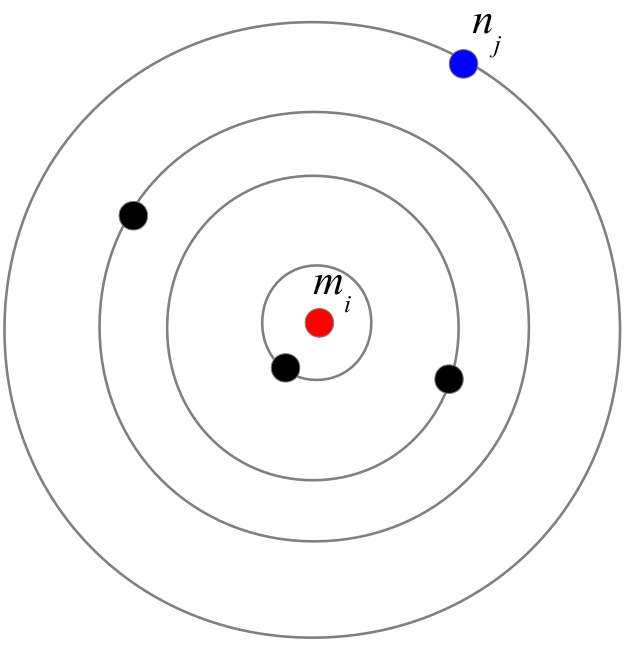

\sffamily

```{r setup, include=FALSE}
knitr::opts_chunk$set(echo = TRUE)
```

##### **Main contact for this notebook: Andrea Parisi (andrea.parisi@warwick.ac.uk)**

### Course context

**Purpose and scope of the course**

This material has been developed as part of the *GeMVi* project: *NIHR Global Health Research Group on the Application of Genomics and Modelling to the Control of Virus Pathogens* in East Africa and the University of Warwick.

In these workshops you will be introduced to some common techniques used in infectious disease modelling. The topics covered will include the implementation of deterministic and stochastic compartmental models, the use of maximum likelihood estimation to analyse super-spreading behaviour in novel disease outbreaks, modelling of contact patterns, and optimisation techniques for fitting epidemic models to real data.

**Contributors**

The contributors are all part of the GeMVi project:

- Prof. James Nokes (JNokes@kemri-wellcome.org)
- Prof. Matt Keeling (m.j.keeling@warwick.ac.uk)
- Dr. Joe Hilton (j.hilton@warwick.ac.uk)
- Dr. Rabia Aziza (rabia.aziza@warwick.ac.uk)
- Dr. Samuel Brand (s.brand@warwick.ac.uk)
- Dr. Andrea Parisi (andrea.parisi@warwick.ac.uk)

**Helpful references for the course**

- Anderson, R. M., & May, R. M. (1992). Infectious Diseases of Humans: Dynamics and Control.
- Bjørnstad, O. N. (2018). Epidemics, models and data using R. https://doi.org/10.1007/978-3-319-97487-3
- Diekmann, O., & Heesterbeek, J. A. P. (2000). Mathematical epidemiology of infectious diseases: model building, analysis and interpretation. 104: John Wiley and Sons.
- Keeling, Matt J., & Pejman Rohani. Modeling Infectious Diseases in Humans and Animals. Princeton University Press, 2008.
- Martcheva, M., 2015. An Introduction to Mathematical Epidemiology, Texts in Applied Mathematics. Springer US, Boston, MA. https://doi.org/10.1007/978-1-4899-7612-3
- Vynnycky, Emilia, & White, Richard G. An Introduction to Infectious Disease Modelling


## **Requirements**

The following packages are required for this tutorial. Please have them installed before the start.

1. pracma - *Practical Numerical Math Routines* implements a number of mathematical functions, a couple of which are used in this tutorial.
2. deSolve - *Differential Equation solver* implements methods to integrate initial value differential equations
3. viridis - *Viridis colour palette* implements the  [viridis](https://github.com/sjmgarnier/viridis) colour palettes, a set of colour palettes that provide perceptually uniform colours, are appropriate for color blindness and render properly in black and white.  Particularly useful for visualising maps.
4. sf - *Simple Features* is a package useful to handle GIS (Geographic Information Systems) datasets.
5. lwgeom [optional] - This is an optional package and is not required for this tutorial. However, it may be needed to handle some vector maps.

The packages may be installed using (uncomment as needed and copy-paste into the console):
```{r}
#install.packages("pracma", "deSolve", "viridis", "sf")
#install.packages("lwgeom")
```


# **Introduction**

In the previous workshop we learned how to build a simple metapopulation model to explore the spatial spread of an infectious disease.  The key to perform simulations of spatial spread is the matrix $\rho_{ij}$ which describes how individual move between the sub populations.  In this workshop we will explore alternative formulations of metapopulation models which may offer an improved description.  We will then focus once again on the $\rho_{ij}$ matrix and describe methods that aim at producing estimates for its entries when data on human mobility is only partially available.  Common situations are when the total number of commuters leaving and entering each sub population is known, but the number of individuals moving between each pair of sub populations is not known, or when data is known for a subset of sub populations.  Models for human mobility may be used to estimate commuting fluxes by optimizing a set of parameters to the known data. In the worst case scenario no data is available, yet it is still possible to use some model of human mobility to build fluxes that can be collectively tuned to explore the dependence of disease spread on human mobility.

We start by loading the required packages:
```{r}
library(pracma)
library(sf)
#library(lwgeom)  # Required by some shapefiles
library(viridis)
```

We then read the data.frames that were produced in the previous workshop. The data is organised as follows:

1. *counties.wgs84* This is the main database, storing polygons of each county, population size, and other information that we do not use.  It uses a coordinate reference system based on latitude/longitude based on the World Geodetic System standard (WGS84).

2. *counties.pop* This contains population sizes for each Californian county

3. *coordinates* List of coordinates of centroids of each county

4. *counties.mapper* This is a look-up dictionary of County name and Id

5. *comm* Commuting data: each row stores the number of commuters travelling from location `src` to location `dst`

```{r}
# Polygons of California counties + other infos
counties.wgs84 <- read_sf(dsn="Data/Local/map.shp")
# Population size of each county
counties.pop <- read.table(file="Data/Local/population.dat", header=TRUE)
# Latitude & longitude of each county
coordinates <- as.matrix( read.table(file="Data/Local/coordinates.dat",
									 header=TRUE) )
# Mapping of county names and county id
counties.mapper <- read.table(file="Data/Local/mapper.dat", header=TRUE)
patches <- nrow(counties.pop)
# Commuting data
comm <- read.table(file="Data/Local/comm.dat", header=TRUE)
```

Let us get back into practice by re-plotting the map of California
```{r}
plot(counties.wgs84['pop'], pal=viridis(9), logz=TRUE, 
	 main="Population of California counties")
```

# **Other metapopulation models for spatial spread**

In the previous workshop we studied a simple metapopulation model described by the following set of equations:
\begin{equation*}
	\begin{array}{lcl}
	\displaystyle\frac{d S_i(t)}{dt} & = & \displaystyle \mu (N_i - S_i(t)) - 
							\beta_i \sum_j \rho_{ij} \frac{S_i(t) I_j(t)}{N_i}\\ \mbox{}\\
	\displaystyle\frac{d I_i(t)}{dt} & = & \displaystyle \beta_i \sum_j \rho_{ij}
							\frac{S_i(t) I_j(t)}{N_i} - (\gamma+\mu)I_i(t).
	\end{array}
	\qquad{(1)}
\end{equation*}

\noindent
Such model is based on the assumption that the disease is spread mostly by the movement of infectious individuals who leave their sub population spreading the disease elsewhere.
The transmission term has the form:
\begin{equation*}
\beta_i \sum_j \rho_{ij} \frac{S_i(t) I_j(t)}{N_i}
\end{equation*}

\noindent
the term describes the fact that susceptible individuals in county $i$ may be infected from infectious individuals 
coming from (and usually resident in) county $j$.  The tranmission matrix $\rho_{ij}$ represents the fraction of the population in $j$ visiting county $i$, scaled by an appropriate factor that takes into account the duration of stay in $i$.  The normalizing factor $N_i$ represents the population of county $i$ and is an indication that we are assuming that contagion occurs in county $i$. Another way to interpret this is that the chance for infectious individuals coming from $j$ to encounter susceptibles from $i$ is proportional to the density of susceptibles in $i$, or $S_i(t)/N_i$.

Transmission however does not necessarily occur because someone infected decides to travel. Susceptible individuals may travel, get the disease while travelling and bring back the disease when they return home.  In this case transmission occur
outside the home county.  A model that describe this process has the form:
\begin{equation*}
	\begin{array}{lcl}
	\displaystyle\frac{d S_i(t)}{dt} & = & \displaystyle \mu (N_i - S_i(t)) - 
							\beta_i \sum_j \rho_{ji} \frac{S_i(t) I_j(t)}{N_j}\\ \mbox{}\\
	\displaystyle\frac{d I_i(t)}{dt} & = & \displaystyle \beta_i \sum_j \rho_{ji}
							\frac{S_i(t) I_j(t)}{N_j} - (\gamma+\mu)I_i(t).
	\end{array}
	\qquad{(2)}
\end{equation*}

\noindent
It is straightforward to rewrite the above equations as:
\begin{equation*}
	\begin{array}{lcl}
	\displaystyle\frac{d \vec{S}(t)}{dt} & = & \displaystyle \mu (\vec{N} - \vec{S}(t)) - 
							\vec{\lambda'} \otimes \vec{S}(t)\\ \mbox{}\\
	\displaystyle\frac{d \vec{I}(t)}{dt} & = & \displaystyle \vec{\lambda'} \otimes \vec{S}(t) - (\gamma+\mu)\vec{I}(t).
	\end{array}
	\qquad{(3)}
\end{equation*}


\noindent
with $\vec{\lambda'} = \vec{\beta} \otimes  \rho^{\mathop\intercal} \cdot (\vec{I} \oslash \vec{N})$.
Here we use the transpose of the transmission matrix built for the previous case.  If $\rho_{ij}$ represents the fraction
of individuals in $j$ visiting $i$,  $\rho_{ji} = \left(\rho^{\mathop\intercal}\right)_{ij}$ is the fraction of individuals from $i$ visiting $j$.


The approaches detailed above consider one of the two transmission modes: either transmission led from infectives moving out of their home county, or individuals acquiring infection elsewhere and returning to their home counties.  In the above descriptions, the contact between the individuals between different subpopulations is modelled, but individuals do not truly move as the population remain the same.  The model described below takes instead a slightly different approach and models the change in population due to the movement of individuals.  Here we assume that contagion occurs in a given county, but the populations of infectives, susceptibles, etc are increased or decreased according to a *transport operator* $\Omega(\{X_i\})$:

\begin{equation*}
	\begin{array}{lcl}
	\displaystyle\frac{d S_i(t)}{dt} & = & \displaystyle \mu (N_i - S_i(t)) - 
							\beta_i \frac{S_i(t) I_i(t)}{N_i} + \Omega(\{S_i(t)\}) \\ \mbox{}\\
	\displaystyle\frac{d I_i(t)}{dt} & = & \displaystyle \beta_i
							\frac{S_i(t) I_i(t)}{N_i} - (\gamma+\mu)I_i(t) + \Omega(\{I_i(t)\}).
	\end{array}
	\qquad{(4)}
\end{equation*}


\noindent
The $\Omega{\{X_i\}}$ operator describes how individuals move between counties:
\begin{equation*}
\Omega(\{X_i\}) = \sum_j \rho_{ij}X_j - \sum_j \rho_{ji}X_i
\end{equation*}

\noindent
Note however, that in this approach the commuting of individuals (moving out and returning back) leads to a clear mixing within each subpopulation: there is no guarantee that those who went from $i$ to $j$ will actually move back.  In this sense, movement of individuals is not properly described. This however does not mean it is not a useful approach: for instance it was used to make predictions on flu pandemics (model description in [Colizza et al. 2007](https://journals.plos.org/plosmedicine/article?id=10.1371/journal.pmed.0040013) and [Colizza et al. 2006](https://www.pnas.org/content/103/7/2015), where a stochastic version is implemented, but the principle is the same).

A more complete and complex approach is to divide the subpopulation into sets of individual staying or travelling.  Given a subpopulation $N_j$,  we identify $N_{ij}$ with the set of individual from subpopulation $j$ currently visiting $i$,
with the understanding that $N_{jj}$ is the set of individuals from $j$ currently staying in $j$.  Thus:
\begin{equation*}
N_j = \sum_i N_{ij}(t)
\end{equation*}

\noindent
is the total number of individual resident in location $j$.
Summing over the second index however, gives the instantaneous population (residents and non residents) in sub population $i$:
\begin{equation*}
N^*_i(t) = \sum_j N_{ij}(t)
\end{equation*}

\noindent
These new variables verify the following set of equations that describes the mobility of individuals.
\begin{equation*}
	\begin{array}{lcl}
	\displaystyle\frac{d N_{ii}(t)}{dt} & = & \displaystyle -\sum_{j\not = i} \bar{\rho}_{ji} N_{ii}(t) + \sum_{j\not = i} \tau N_{ji}(t) \\ \mbox{}\\
	\displaystyle\frac{d N_{ij}(t)}{dt} & = & \displaystyle \bar{\rho}_{ij}N_{jj}(t) - \tau N_{ij}(t)
	\end{array}
\end{equation*}


\noindent
The matrix $\bar{\rho}_{ij}$ represents as the fraction of individuals from $j$ who visit $i$ (for commuting data that would be the number of daily commuters divided by their population size of origin), whilst $\tau$ is the rate of return to the home location.  $\tau$ may also be a matrix, but it is often simplified to a common rate representing the inverse of the time spent at the destination.  The relationship between our definitions of contact matrix is $\bar{\rho}_{ij}\times 1/\tau = \rho_{ij}$

Similarly to the above equations, we can write $I_j = \sum_i I_{ij}$ and $S_j = \sum_i S_{ij}$ and write the corresponding set of equations as follows:
\begin{equation*}
	\begin{array}{lcl}
	\displaystyle\frac{d S_{ii}(t)}{dt} & = & \displaystyle \mu (N_{ii}(t) - S_{ii}(t)) - 
							\beta_i S_{ii}(t) \frac{\sum_j I_{ij}(t)}{\sum_j N_{ij}(t)} 
							- \sum_{j\not = i} \bar{\rho}_{ji} S_{ii}(t) + \sum_{j\not = i} \tau S_{ji}(t) \\ \mbox{}\\
	\displaystyle\frac{d S_{ij}(t)}{dt} & = & \displaystyle \mu (N_{ij}(t) - S_{ij}(t)) - 
							\beta_i S_{ij}(t) \frac{\sum_j I_{ij}(t)}{\sum_j N_{ij}(t)} +
							\bar{\rho}_{ij}S_{jj}(t) - \tau S_{ij}(t)\\ \mbox{}\\
	\displaystyle\frac{d I_{ii}(t)}{dt} & = & \displaystyle \beta_i S_{ii}(t) \frac{\sum_j I_{ij}(t)}{\sum_j N_{ij}(t)}
							- (\gamma + \mu) I_{ii}(t)
							- \sum_{j\not = i} \bar{\rho}_{ji} I_{ii}(t) + \sum_{j\not = i} \tau I_{ji}(t) \\ \mbox{}\\
	\displaystyle\frac{d I_{ij}(t)}{dt} & = & \displaystyle \beta_i S_{ij}(t) \frac{\sum_j I_{ij}(t)}{\sum_j N_{ij}(t)}
							- (\gamma + \mu) I_{ij}(t) +
							\bar{\rho}_{ij}I_{jj}(t) - \tau I_{ij}(t)\\ \mbox{}\\
	\end{array}
\end{equation*}

\noindent
The model above, consisting of $3n^2$ differential equations ($n$ being the number of sub populations), is amenable to simplifications depending on the values of $\bar{\rho}_{ij}$ and $\tau$.  Further details may be found in the following:

- Sattenspiel, L., and Dietz, K. (1995). A structured epidemic model incorporating geographic mobility among regions. Mathematical Biosciences 128, 71–91.
- Keeling, M.J., and Rohani, P. (2002). Estimating spatial coupling in epidemiological systems: a mechanistic approach. Ecology Letters 5, 20–29.
- Keeling, Matt J., & Pejman Rohani. Modeling Infectious Diseases in Humans and Animals. Princeton University Press, 2008.


# **Models for human mobility**

In order to describe the spatial spread of an infectious disease, knowledge of the contact matrix $\bar{\rho}_{ij}$ is 
essential.  However, often this is not readily available: in this case, one would like to have a formula that can 
express $\bar{\rho}_{ij}$ as a function of a tunable set of parameters and other characteristics related to the population.
Our approach to $\bar{\rho}_{ij}$ has been to identify it with the fraction of individuals from $j$ that travels to $i$, that is $\bar{\rho}_{ij} = T_{ji}/N_j$ where $T_{ij}$ represents the actual number of individuals travelling from $i$ to $j$.  Note that $\bar{\rho}_{ij}$ represents the number of individuals moving from $j$ to $i$, whereas $T_{ij}$ represents the number of individuals travelling from $i$ to $j$.  The different notation reflects the conventions used in these two distinct domains. Models for human mobility typically attempt to provide an estimate for $T_{ij}$.  Several models have been proposed in recent years to model human mobility. Among these, two have been predominant: the Gravity model and the Radiation model.

## **Gravity model**

The Gravity model was proposed multiple times within the field of Economics, with the earliest reference dating back to 1924 in an attempt to describe a migration law based on the Gravity Law in Physics.  The Gavity Law states that the force between two masses $m_1$ and $m_2$, is proportional to the product of the two, divided by their distance squared: $F_{12} = -G m_1 m_2/r_{12}^2$.  The original formulation mimicked this form, however in its current formulation the model predicts that the number of individuals travelling from location $i$ to location $j$ is given by:
\begin{equation*}
T_{ij} = C \frac{n_i^\alpha n_j^\beta}{f(r_{ij})}
\end{equation*}

\noindent
where $n_i$ and $n_j$ are the populations at locations $i$ and $j$, whilst $\alpha$, $\beta$ and $C$ are model parameters.  The above expression is valid for all $i \not = j$.  The function $f(r_{ij})$ is an increasing function of the distance $r_{ij}$ between $i$ and $j$, so that the far away places have a small flux. A typical form for the distance function is $f(r_{ij}) = r_{ij}^\gamma$, with $\gamma$ an additional model parameter.  The fluxes $T_{ij}$ thus depend on four parameters: $C$, $\alpha$, $\beta$ and $\gamma$.  We can easily estimate these parameters so that they describe the commuting fluxes in California.
Using logarithms we get:
\begin{equation*}
\log T_{ij} = \log C + \alpha \log n_i + \beta \log n_j - \gamma \log r_{ij}
\end{equation*}

\noindent
Therefore we only need to build a data.frame with the above data and use a linear fitting method.
```{r}
comm.model <- data.frame( src=as.integer(), dst=as.integer(),
			pop.src=as.integer(), pop.dst=as.integer(),
			flux=as.numeric(), dist=as.numeric() )

for (src in 1:patches)  {
	for (dst in 1:patches)  {
		if (src == dst)  {
			next
		}

		hasentry <- nrow(comm[ comm$dst == dst & comm$src == src, ])
		if (hasentry)  {
			flux <- comm[ comm$dst == dst & comm$src == src, ]$Total
		} else {
			flux <- 0
		}
		popsrc <- as.numeric(counties.pop[ counties.pop$id == src, ]$pop)
		popdst <- as.numeric(counties.pop[ counties.pop$id == dst, ]$pop)
		dist <- haversine( coordinates[src,], coordinates[dst,] )

		comm.model <- rbind( comm.model, data.frame(src=src, dst=dst, 
				pop.src=popsrc, pop.dst=popdst, flux=flux, dist=dist) )
	}
}
#counties.pop
nrow(comm.model)

grav_model <- lm( log(flux) ~ log(pop.src) + log(pop.dst) + log(dist), 
				  data=comm.model[comm.model$flux > 0,], na.action = "na.omit" )
summary(grav_model)
comm.model$pred_grav_model <- exp( predict(grav_model, comm.model) )
head(comm.model, n=10)
```


## **Radiation model**

The Radiation model has the form:

\begin{equation*}
T_{ij} = T_i \frac{m_i n_j}{(m_i+s_{ij})(m_i+n_j+s_{ij})}\qquad(1)
\end{equation*}

\noindent
where $m_i$ and $n_j$ represent the number of individuals in locations $i$ and $j$ respectively.  The terms $s_{ij}$ represent the number of individuals leaving in a circle of radius $r_{ij}$ centered in $i$, excluding the populations in $i$ and $j$.  Note that the model uses two distinct variable names (`m` and `n`) for the source and destination populations: this is linked to the different meaning the two have in the model construction, however for most purposes the two can be considered equivalent and correspond simply to population sizes.  The term $T_i = \displaystyle m_i\frac{N_c}{N}$ represents the total flux out of location $i$ and is expressed as a fraction $N_c/N$ of the population in $i$, where $N$ is the total population *in the map* under consideration, and $N_c$ is the number of individuals participating in commuting (thus $N_c/N$ represents the fraction of the population that leaves their home counties to work, for instance, in another county).  In theory, the number $N_c$ can be calculated by summing all the fluxes appearing in the data, which provides the total number of individuals participating in commuting between counties. However, the fraction $N_c/N$ could be treated as the only unknown of the model and can be fitted to the data.

```{r, echo=FALSE, out.width="250px"}

```

*The terms $m_i$ and $n_j$ refer to the source location (in red) and destination (in blue).  The term $s_{ij}$ corresponds to the population of the locations in-between, represented in black.*

The tricky part in dealing with this model is to build the terms $s_{ij}$.  To do that, for each county we must order the other counties by distance and then calculate the partial cumulative sums as follows:


```{r}
# Order for each county and then by distance
comm.model <- comm.model[ order(comm.model$src, comm.model$dist), ]
# For each src, build cumulative sums of pop.dst
# Note that we are exluding the population at the source
sij_list <- tapply( comm.model$pop.dst, comm.model$src, function(x) if (length(x) > 1)  {c(0, cumsum( x[1:length(x)-1] ))} else {c(0)} )
# Output from tapply is a list. Thus unlist.
comm.model$sij <- as.numeric( unlist( sij_list ) )
```

We now evaluate the factor that multiplies $N_c/N$ in the equation of the radiation model (1). That is, we can write $T_{ij} = \frac{N_c}{N} f_{ij}$ and thus calculate
\begin{equation*}
f_{ij} = m_i \frac{m_i n_j}{(m_i+s_{ij})(m_i+n_j+s_{ij})}
\end{equation*}

```{r}
# Evaluate the factor that multiplies $N_c/N$ in the radiation model
comm.model$fact_radModel <- comm.model$pop.src * 
	comm.model$pop.src*comm.model$pop.dst / 
	((comm.model$pop.src+comm.model$sij)*
	 	(comm.model$pop.src+comm.model$sij+comm.model$pop.dst))
head(comm.model)
```

As $T_{ij} = f_{ij}\ N_c/N$, it is straightforward to estimate the optimal value of the ratio $N_c/N$ that fits the model predictions to data.
```{r}
# Now fit to data. The term '-1' sets the intercept to zero
rad_model <- lm( flux ~ fact_radModel - 1, comm.model )
# The fitted parameter is N_c/N
summary(rad_model)
```

The result of the fitting tells us that less than 6.5\% of the population commutes between different counties.  Modelled fluxes can now be easily obtained:
```{r}
# Evaluate predicted fluxes
comm.model$pred_rad_model <- predict(rad_model, data=comm.model)
```


We can now verify how good these predictions are. We can do this by plotting the predicted vs true fluxes.
```{r}
plot( comm.model$flux, comm.model$pred_rad_model, col=rgb(1,0,0,0.5), 
	  ty='p', log="xy", xlab="Flux", ylab="Prediction", 
	  main="Comparison between true and predicted fluxes" )
lines( comm.model$flux, comm.model$pred_grav_model, col=rgb(0,0.5,0,0.5), ty='p' )
abline( a=0, b=1, col=rgb(0,0,0,0.8), lw=2, lty='dashed')
legend( "bottomright", col=c(rgb(1,0,0,0.7), rgb(0,0.5,0,0.7)), 
		legend=c("Radiation Model", "Gravity Model"), bty="o", pch=22)
```

If the models were able to reproduce the true fluxes, all point would fall on the diagonal (the black dashed line).  Unfortunately no existing model currently is able to exactly reproduce the fluxes observed in the real world.  Nevertheless, predictions show some degree of correlation with the true fluxes.

## **Exercises**

- *Exercise 1* - To fit the Gravity model we had to exclude entries with zero flux.  To fit the Radiation model we did not exclude these entries.  Does it matter?


## **Common Part of Commuters**

In order to quantify how well a model is able to reproduce the true fluxes, a measure of similarity called the *Common Part of Commuters* is often used. This is defined as:

\begin{equation*}
CPC(\{T_{ij}\},\{T^*_{ij}\}) = \frac{2\sum_{ij} \min (T_{ij}, T^*_{ij})}
		{\sum_{ij} T_{ij} + \sum_{ij} T^*_{ij}}
\end{equation*}

\noindent
where $T^*_{ij}$ are the predicted fluxes and $T_{ij}$ are the true fluxes.  The CPC index reaches value 1 when all predicted fluxes match the data, and falls to zero when the discrepancy between the two is large.  Let us define a function that implements the above formula:

```{r}
CPC <- function( data, colname )  {
	numerator <- 2*sum( apply( data, 1, function(x) {min(x['flux'], x[colname])}) )
	denominator <- sum(data['flux']) + sum(data[colname])
	return(numerator/denominator)
}
```

We can now use the formula to evaluate the goodness of the fluxes predicted by the radiation model and the gravity model:
```{r}
print(CPC(comm.model, 'pred_rad_model'))
print(CPC(comm.model, 'pred_grav_model'))
```


How good are these predictions?  Typical values for the CPC that are obtained for these model do not exceed much 0.5.  Thus the radiation model in this case seems to do a better job.  However, this is not always the case, and the Gravity model often leads to better predictions.


## **Exercises**

- *Exercise 2* - Take 5 distinct random subsets of commuting data and estimate the parameters of the radiation model for each subset.  How do they compare with the parameters measured from the full set?

- *Exercise 3* - Order the commuting data in terms of fluxes from the largest to the smallest; take the first $p$ fluxes and estimate the radiation model parameter.  How does the estimate change with $p$?  What does this tell us about parameter estimation for scarce data?

- *Exercise 4* - Order the commuting data in terms of size of the source population from the largest to the smallest; take the first $p$ fluxes and estimate the radiation model parameter.  How does the estimate change with $p$?  What does this tell us about parameter estimation for scarce data?

- *Exercise 5* - Compare the spread of an SIR model where the spatial contact matrix is obtained from true data with that predicted with the radiation model.  You can use the build.contact.matrix function introduced in the previous workshop.  Can you see any difference in the outcomes?


```{r}
write.table(comm.model, file="Data/Local/commframe.dat", 
			col.names=TRUE, row.names=FALSE)
```
