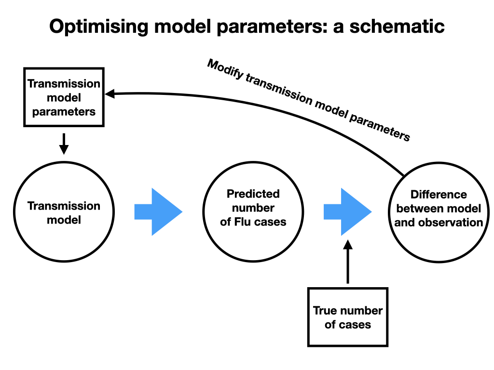

```{r setup, include=FALSE}
knitr::opts_chunk$set(echo = TRUE)
```

###### **Main contact for this notebook: Samuel Brand (S.Brand@warwick.ac.uk)**
<br>

## 1. Motivation: Connecting epidemic theory to epidemic reality

You've encountered the concepts and theory behind the susceptible-exposed-infectious-recovered (**SEIR**) model. To recap, the reasoning behind the basic SEIR model is that it 1) captures the essential epidemiology of infectious diseases where infected people are only infectious for a comparatively short period, followed by a much longer (or permanent) period of immunity to reinfection, combined with 2) postulating that a mass-action/homogeneous approximation to transmission rates is reasonable.

It is difficult _a priori_ to assess whether the argument behind the SEIR model is persuasive. Obviously, the SEIR model is a gross simplification of complex reality both at the level of the host immune system response, and, at the level of social interactions that could cause transmission. Nonetheless, we could argue that although the SEIR model is a simplification, it is a useful simplification because the SEIR model is mechanistic, rather than purely statistical, and therefore could be capturing some average transmission over groups. Moreover, the SEIR model has interpretable parameters, in particular the reproductive number $R_0$ that is an important summary statistis to capture for any epidemic. The interpretability of the parameters in the SEIR model should be contrasted with generic machine learning models like artificial neural networks (ANNs). ANNs can be fitted accurately to data, and might even be somewhat accurate at forecasting short periods ahead of data, but the lack of interpretability means that it can be hard to draw conclusions from a generic machine learning model. To quote George Box, "*All models are wrong, but some are useful*".

In this workshop we are going to make parameter inferences from a real epidemic data set, the reported new influenza hospitalizations per week in Minnesota state, USA. We will address whether real epidemic data is consistent with the basic SEIR model; in the sense that there exist parameters for the SEIR model which predict an epidemic similar to the actual epidemic occurred. The model parameters which the minimize the fitted error (or loss) between the model prediction using those parameters, and the actual data will be **estimators**. In particular, this is an important way of getting an estimator for $R_0$, which can be difficult to estimate from direct studies. We will discuss the technical details behind finding the parameters that minimise error between model prediction and actual data, and show that this optimization method finds **maximum likelihood estimators**, an important class of estimators with good statistical properties. Finally, we will use the model comparison techniques we first encountered in workshop 2 to compare the data support for some different models.


**Key learning objectives**:

* Understanding how a mathematical model of disease spread can predict the data that is collected in the real-world.
* What is a "fit"? And what is the best fit? We will be minimizing the error between the model prediction and the data reality.
* Interpreting and plotting fits to epidemic data.
* Comparing different model fits to the same data.

## 2. Fitting dynamic transmission models to data

We start with an overview of the sequence of steps were have to go through to fit parametric dynamic transmission models to real epidemic data.

**Overview:**

<center> </center>

This schematic diagram gives the essential idea of optimising parameters for a dynamic transmission model so that they best reflect available data:

1. Define a transmission model and its parameters that you want to optimise, and gather the data used to fit the model. [**Model selection**].
2. Solve the transmission model for these parameters [**Numerical ODE solver**].
3. Calculate the observations predicted by the transmission model with these parameters [**Prediction/observation model**].
4. Calculate the error between the model prediction *for your current parameters* and the actual data available [**Loss function**].
5. Return to 1., but use new parameters that improve the error [**Numerical optimisation**].

### 2.1 Data and model selection

The data we are going to fit to are weekly Influenza hospitalisation rates per 100,000 people reported by [CDC FluSurv-NET/EIP](https://www.cdc.gov/flu/weekly/influenza-hospitalization-surveillance.htm). We choose to download data for Minnesota because of a combination of high population coverage of surveillance (second highest after New Mexico), and, a cool autumn/winter climate which promotes Influenza transmission (compared to semi-arid New Mexico which has a lower per-capita Flu disease rate).

Below we plot the downloaded data, it represents new hospital cases per week with influenza-like symptoms who *also* then received a confirmatory influenza test.
```{r}
flusurv <- read.csv(file='data/FluSurveillance_EIP_Minnesota_Data.csv')

plot(flusurv$MMWR.YEAR*52.2 + flusurv$MMWR.WEEK - 2003*52.2,flusurv$WEEKLY.RATE,
     pch = 19,
     type = "p",
     col = "red",
     cex = 0.2,
     ylab = "Weekly hosp. per 100,000 people",
     xlab = "Week after beginning of 2003",
     main = "Minnesota: Reported Flu hospitalizations")
```

The long-term dynamics of flu hospitalizations are clearly complex. In this notebook we will fit a simple transmission model to a **single** season of influenza; namely the 2017-2018 season when detected peak disease incidence was highest over our data period. The flu season data begins for week 40 of 2017 (week starting 2nd October 2017), however, it will be more convenient to treat this date as time zero and consider this week 1 of the fitting period. 

```{r}
season_flu <- subset(flusurv,SEASON=="2017-18",select = c(MMWR.WEEK,WEEKLY.RATE))
weekly_hosp = season_flu$WEEKLY.RATE
weeks_from_season_start = season_flu$MMWR.WEEK
weeks_from_season_start = weeks_from_season_start - 39
weeks_from_season_start[which(weeks_from_season_start < -5)] = weeks_from_season_start[which(weeks_from_season_start < -5)] + 52

plot(weeks_from_season_start,weekly_hosp,
     pch = 19,
     type = "p",
     col = "red",
     ylab = "Weekly hosp. per 100,000 people",
     xlab = "Week after beginning 2nd Oct 2017",
     main = "Minnesota: Worst peak season 2017-2018")

```

##### *$\rightarrow$Try it yourself*

Understanding the data before you try and fit a model is important, and visual exploration is a useful tool towards understanding. Use the code cell below to try plotting a different season, or perhaps go back to [CDC FluSurv-NET/EIP](https://www.cdc.gov/flu/weekly/influenza-hospitalization-surveillance.htm) to find data to visualize for other US states.

```{r}
## cell to use if needed


#
```


**Choosing Model parameters**

We start by defining the parameters of the SEIR transmission model for Influenza. Some parameters will be drawn from literature estimates:

* $\sigma$ = 7/0.8, incubation rate per week -- mean 0.8 days infected but not infectious (Ferguson 2005, Baguelin 2013).
* $\gamma$ = 7/1.8, recovery rate per week --- mean 1.8 days actively infectious (Ferguson 2005, Baguelin 2013).
* N = 0.55 * 5.6 million, Covered population size of Minnesota (55% surveillance coverage).

The main parameter we want to estimate is the reproductive number $R_0$, however, a key consideration of dynamic models is that they evolve from a state in the past. Therefore, we also need to consider the initial number of exposed $E(0)$, infectious $I(0)$ and immune people $R(0)$ at the beginning of the transmission prediction period. Moreover, influenza is known to be seasonal, therefore, we also consider two different models for the reproductive ratio:

1. The standard model where the reproductive number doesn't change with time $R(t) = R_0$.
2. A seasonal model where the transmission rate changes with time, and has a yearly peak at the $\phi$th week of the year:
$$
        R(t;R_0,\xi,\phi) = R_0(1 + \xi \cos(2\pi (t-\phi)/52.2)))
$$
In this model, $R_0$ is essentially the mean value of the time-varying reproductive number over the season.

**Transmission model dynamics**

You should notice that if $\xi = 0$ the two different models are really the same model. Therefore, we can write the dynamics for both models.

$$
\dot{S} = -\gamma  R(t;R_0,\xi,\phi) \frac{SI}{N}, \\
\dot{E} = \gamma  R(t;R_0,\xi,\phi) \frac{SI}{N} - \sigma  E , \\
\dot{I} = \sigma E - \gamma I, \\
\dot{R} = \gamma I , \\
\dot{C} = \gamma  R(t;R_0,\xi,\phi) \frac{SI}{N}.
$$
The $S,E,I,R$ compartments should be very familiar by now, the $C$ compartment is the cumulative number of infected people by time $t$, which will be useful for comparing the model predictions to data. 

### 2.2 Numerical ODE solution

Before fitting the data we need to define the model as R code, as in previous workshops. To do this we also define a helper function `R_t` which calculates the $R(t;R_0,\xi,\phi)$ value for different times and parameters.

```{r}
## Load deSolve package
library(deSolve)

# Seasonal function
R_t <- function(time,R_0,xi,phi)
  return(R_0*(1 + xi * cospi(2 * (time - phi) / 52.2)))
end

## Create an seasonal SEIR function
seir <- function(time, state, parameters) {
  with(as.list(c(state, parameters)), {
    dS <- -gamma * R_t(time,R_0,xi,phi) * (S * I/N)
    dE <-  gamma * R_t(time,R_0,xi,phi) * (S * I/N) - sigma * E
    dI <- sigma * E - gamma * I
    dR <- gamma * I
    dC <- gamma * R_t(time,R_0,xi,phi) * (S * I/N) 
    return(list(c(dS,dE, dI, dR,dC)))
  })
}
```

It is **always** helpful to visualize the predictions of models for a few different choices of parameters, and also always keep in mind your background knowledge about the pathogen you are modelling. For influenza, a major reason it returns each year is antigenic drift across the circulating strains as the various flu strains evolve and evade population immunity. Nonetheless, outside of a pandemic strain, we expect that a fairly large proportion of people will be immune to various circulating strains each year. So we make a (slightly) informed guess that _maybe_ 30% of the population is immune at the beginning of the season, and therefore, we want the mean $R_0 \approx 1.8$ (otherwise no epidemic). Assuming quite large seasonal amplitude ($\xi = 0.5$) we get this guess for the possible dynamics:

```{r}
## Parameters

#N = 0.55*5.6e6 
N = 5.6e6 
parameters <- c(sigma=7/0.8, gamma=7/1.8, R_0 = 1.8,xi = 0.5, phi = 21.5, N = N)

## Numbers in each compartment:
init <- c(S= (0.7*N), E = 5000, I=5000, R=0.3*N,C = 0)

## Solve for the 30 weeks of the season data
results_guess <- ode(y=init, times=seq(0, 30, by=1), func=seir, parms=parameters)

## Plot the solution
df_guess<-as.data.frame(results_guess)
plot(df_guess[,1],df_guess[,2],
    type="l",
    col="black",
    lwd=2,
    xlab="Week after beginning of season (2nd Oct 2017)",
    ylab="Numbers",
    main="Seasonal Influenza model",
    ylim = c(0,5.5e6))

lines(df_guess[,1], df_guess[,3], col="darkgreen",lwd=2)
lines(df_guess[,1], df_guess[,4], col="red",lwd=2)
lines(df_guess[,1], df_guess[,5], col="lightblue",lwd=2)
lines(df_guess[,1], df_guess[,6], col="darkblue",lwd=2)

      
legend("left",
   c("S","E","I","R","C"),
    fill=c("black","darkgreen","red","lightblue","darkblue")
  )
```

We see that for our guessed parameters we predict that peak number of infecteds occurs around week 14 after the beginning of the Flu season. This would seem to align reasonably with our hospitalization data. However, we need to go into more details. First, how can we connect the five compartments of the transmission model to the weekly hospitalization data? Second, can we quantify what a "reasonable" fit is?

##### *$\rightarrow$Try it yourself*

The seasonal $R(t)$ model we used is quite common, but its far from the only option. Other ways of introducing seasonal forcing might be to have different $R(t)$ values depending on whether it is school holidays or not. Try researching seasonal forcing functions in the literature and implementing them in R below.

```{r}
## cell to use if needed


#
```

### 2.3 The observation model

We can't determine how close our guess of the parameters is to reality without determining what predictions the model, with a current estimate of the parameters, make _that can be directly compared to the available data_. Therefore, we not only need a model of how the underlying transmission is going in the population, but also a model of how transmission ultimately connects to data we observe. We call this the _observation model_. An important principle of fitting epidemic models is that **when fitting transmission models to epidemic data you must often spend as much, or more, effort on developing the observation model than on the transmission model itself.**

The CDC influenza data is grouped by US state, and reports only the weekly rate of hospitalizations per 100,000 people in the CDC surveillance coverage area in the state. We should note that the hospitalization rate **doesn't** directly tell us how many susceptible, exposed, infectious and recovered/immune people are in the CDC surveillance coverage area in the state, therefore, we can't simply fit all our dynamic variables to observations over time. We need to think about what the CDC influenza data does tell us. In this case we are going to make a very simple observation model,
$$
H(week_n) \sim \mathcal{N}(\epsilon p_{cov}  ( C(n) - C(n-1))/N_{surv}, \sigma^2) \qquad n = 1,\dots,30.
$$
In words, this observation model assumes that after someone gets infected with Flu, then there is a chance that that person will 1) develop sufficient symptoms that they require hospitalization, 2) receive an influenza test which accurately diagnoses influenza, and 3) this occurs within the CDC surveillance coverage area for the state, about 55% of the state population is covered by surveillance in Minnesota. We denote the probability that 1) and 2) happen for someone, that is detection by hospitalization, as being $\epsilon$, and the probability that someone detected by hospitalization and testing was covered within our transmission model is $p_{cov}$. Assuming normal errors, then the number of hospitalizations _actually observed_ per 100,000 people covered by surveillance on week $n$, which we denote $H(week_n)$, is normally distributed around the number of new infections that week predicted by the model ($\epsilon p_{cov}(C(n) - C(n-1))$) rescaled to be per 100,000 among the CDC surveillance population (factor $1/N_{surv} = 10^5/(0.55N)$).

Determining $\epsilon$ has been a major challenge in influenza studies, because it is hard to know how many people in total get infected each season, and therefore, our choice of denominator data to compare to detected cases can lead to significantly divergent estimates (Wong et al, 2013). We use three sources of information to "ball-park" a guess for $\epsilon$: 

1. The under-reporting ratio of the compared to true numbers of hospitalizations is about three (due to hospital cases not receiving an Influenza test or receiving a false negative test; (Reed et al, 2015)). 
2. The ratio of mid-range estimates of seasonal hospitalizations to mid-range estimates of seasonal Influenza symptomatic illness, which is [~1.7%](https://www.cdc.gov/flu/about/burden/index.html) based on (Reed et al, 2015).
3. About a two-third of influenza infections lead to symptomatic illness (Patrozou and Mermel, 2009). 

Combining this information gives a rough estimate $\epsilon = 3.8\times 10^{-3}$; that is we expect about 0.38% of influenza infections in the USA to get detected by hospitalization, which we will use in this notebook. 

Determining $p_{cov}$ depends on the _scale_ at which we are modelling the seasonal flu epidemic in Minnesota. To see this we can consider two modelling approaches: first, we can model the influenza transmission for the whole state ($N=5.6$ million) and assume that the CDC surveillance area in Minnesota is a representative sub-sample of the wider epidemic in Minnesota. In this case, $p_{cov} = 0.55$ because 55% of the Minnesotan population lives in the CDC surveillance area. Second, we can model the epidemic as being driven by transmission dynamics mainly occurring locally in the CDC surveillance area ($N = 0.55\times5.6$ million). In this case, $p_{cov} = 1$ because by construction we are only modelling people who are in the CDC surveillance area.

Finally, we are assuming that an infection on week $n$ is detected also on week $n$, rather than later, and, we have not discussed the variance of our observation prediction, $\sigma^2$. It will turn out that $\sigma^2$ doesn't impact our estimators in the simplest case we will look at (_see below_), but this is not always going to be true! The value of $\sigma^2$ will impact on our model selection process (also _see below_).  

We can plot the hospitalization prediction of our guessed parameters (see above) against the real hospitalization data:

```{r,echo=FALSE}
plot(weeks_from_season_start,weekly_hosp,
     pch = 19,
     type = "p",
     col = "red",
     ylab = "Weekly hosp. per 100,000 people",
     xlab = "Week after beginning of season (2nd Oct 2017)",
     main = "Comparison plot (Minnesota 2017-2018 Flu season)")
N_minnesota = 5.6e6 #Population size of Minnesota
N_CDC_coverage = 0.55*N_minnesota #Population size of CDC Flu surveillance area in Minnesota
epsilon = 3.8e-3 # Probability of hospitalization and then detection
C = df_guess[,6] # Model prediction of cumulative number infected by end of each week 
pred = (1e5/N_CDC_coverage) * 0.55 *epsilon * diff(C)# Model prediction of number of new hospitalizations per 100,000 people in each week 
lines(1:30,pred)
legend("right",
       c("Data","'Guess'"),
       fill = c("red","black"))

```

We can see that although our informed guess got the peak about right, overall there is substantial divergence between the guess prediction and the data. We need to improve our guess.


### 2.4 The loss function

Before we can improve upon our  first guess of the parameters for the transmission model we need to decide what "improvement" means in this context. Our goal will be to find the parameters that minimise the discrepancy between the model prediction of the number of detected influenza hospital cases [the **prediction/observation model**] and the true observed data.

However, there are many way to measure the discrepancy. In this note, we will consider a very popular choice for measuring the error, or _loss_, between model predictions and data: the **Least squares loss function**,
$$
    \mathcal{E}_{LS}(\theta) = \sum_{n=1}^{30} \Big[H_{pred}(n; \theta)  - H(week_n)\Big]^2.
$$
Where $H_{pred}(n; \theta) = \epsilon p_{cov}(C(n) - C(n-1))/N_{surv}$ is the prediction of the model on the $n$th week using parameters $\theta$. Least squares measures the squared difference between the model prediction and the true data summed over all the weeks in the data set. The goal is to tune our parameters so that the least squares loss is as small as we can make it. For our guessed parameters the least squares loss was $\mathcal{E}_{LS}(\theta_{guess}) =$ `r sum((weekly_hosp - pred)^2)`.

**Connection to maximum likelihood estimation**

It is straightforward to see that our least squares estimator **also** maximizes the likelihood of our probabilistic observation model (*this is left to the reader to check*). Therefore, our learning about maximum likelihood estimators also applies (*see Workshop 2*), as well as the nice theoretical properties of maximum likelihood estimators: e.g. asymptotically normal, unbiased, and statistically efficient. However, this will not always be true, and relies on our normality assumption and our assumption that the variance between the model prediction and observed data is constant over all the weeks. Least squares estimators are often comparatively easy to calculate, and require less statistical decision-making than building a more complicated statistical observation model, but don't have as good a theoretical guarantee for estimator quality in general. 

An important aspect to note about our probabilistic observation model is that we assumed that the variance in the prediction $\sigma^2$ was _independent_ of the mean of the prediction. Therefore, the maximum likelihood/least squares estimation does not depend on $\sigma^2$. 

The data we have on determined Influenza hospitalizations is scaled as hospitalisations per 100,000 people covered by the surveillance area. It is natural to treat this like a continuous number, and this approximation matches with the underlying assumption that it is reasonable to treat the epidemic compartments as continuous, i.e. we can use an ODE transmission model. However, the underlying numbers of people hospitalized were actually integer _count data_. It is common to model count observations from continuous epidemic models as being linked by *Poisson* observation noise; in our case *if* the data had been in numbers hospitalised we could have used this observation model:
$$
H(week_n) \sim Poisson(\epsilon p_{cov} (C(n) - C(n-1))) \qquad n = 1,\dots,30.
$$

##### *$\rightarrow$Try it yourself*
Can you work out what the appropriate loss function for the Poisson observation model so that minimizing the loss is equivalent to producing maximum likelihood estimators, and fill in the Latex block below?
$$
    \mathcal{E}_{Poi}(\theta) = ???
$$
We don't have count data. We could estimate the true counts by scaling up our data and rounding to the nearest integer, or we could use the _normal approximation to the Poisson distribution_; that is if $X\sim Poisson(\lambda)$ then $X\approx\sim \mathcal{N}(\lambda,\lambda)$ where the quality of the approximation improves as $\lambda$ gets bigger. If the underlying weekly counts were $X_n \sim Poisson(\lambda_n)$ for weeks $n = 1,...,30$ then the data we receive is rescaled to be per 100,000 people, $X_n / N_{surv}$. What is the normal approximation to this observation model? Can you write out the appropriate loss function for the normal approximation to underlying Poisson data that has been rescaled to be per 100,000?
$$
    \mathcal{E}_{\text{norm_approx}}(\theta) = ???
$$
The main differences between the normal approximation to the Poisson distribution compared to assuming normal errors with some (unknown) variance $\sigma^2$ are: first, the normal approximation to the Poisson distribution does not a free parameter for the observation variance, and second, therefore, the observation variance is not the same every week. How does this impact our estimation of parameters? If we predict that transmission will be higher on some week $m$ and lower on some other week $n$, in which week will the normal approximation to the Poisson distribution have a higher penalty for an observation error of (say) 1 hospitalization per 100,000 people?

### 2.5 Numerical optimisation

Now we need to think about how we find the parameters that minimize the least squares loss function. Because the transmission model is non-linear, and we need to use a numerical ODE solver to make predictions, we also have to use a numerical method to find the minimizing parameters. **All optimization methods tend to perform more efficiently when the target parameter set is smaller and have similar scaling.** Towards this we choose this representation of our parameters to fit:

* $\iota$, the proportion immune at the beginning of the season.
* $\tilde{E} = \log_{10}(E(0))$, the base 10 log of the initial numbers of exposed people. We assume that the initial number of infectious people is negligible compared to recently infected exposed people.
* $R_0,\xi,\phi$, the mean reproductive ratio, seasonal amplitude and phase discussed above.
* $P_{eff} \in [0.55,1]$. This is a modelled population size scale. This effects the model predictions in two ways: 1) $N = P_{eff}\times 5.6$ million, the population size being modelled for transmission, and, 2) $p_{cov} = 0.55/P_{eff}$ the chance that someone in the model is hospitalized and tested is also in the coverage area for detection. The extremals $P_{eff} = 0.55$ and $P_{eff} = 1$ are the two scenarios we considered in the observation model section, $P_{eff} = 0.55$ corresponds to fully local dynamics of the CDC surveillance area, whereas, $P_{eff} = 1$ corresponds to the CDC surveillance area being a representative sub-sample of an epidemic across the state of Minnesota.

We can now define code for our **objective function** (the function that will be minimized). This function receives a choice of parameters and returns the loss compared to the data of the transmission model using those parameters. We will consider four models:

1. A **full model** where all the parameters described above vary.
2. A **state-wide seasonal** model ($P_{eff} = 1$, but other parameters vary).
3. A **fully-local seasonal** model ($P_{eff} = 0.55$, but other parameters vary).
4. A **state-wide non-seasonal** model ($P_{eff} = 1$, $\xi = 0$, but other parameters vary).

##### *$\rightarrow$Try it yourself* 
_What is the nesting structure of these models?_


```{r}
#We can exploit the nesting structure for these models so we only need to define one objective function

obj_func <- function(params_to_fit)
  #params_to_fit is a vector
  #params_to_fit[1] = iota
  #params_to_fit[2] = log_10(E(0))
  #params_to_fit[3] = R_0
  #params_to_fit[4] = xi
  #params_to_fit[5] = phi
  #params_to_fit[6] = P_eff

  ## Check that parameters are in their ranges if not set the loss very high
  if (params_to_fit[1] > 0 & params_to_fit[1] <= 1  & params_to_fit[3] > 0 & params_to_fit[4] >= 0 & params_to_fit[4] <1 & params_to_fit[6]>=0.55 & params_to_fit[6] <= 1 ){
    N_minnesota = 5.6e6 #Population size of Minnesota
    N_CDC_coverage = 0.55*N_minnesota #Population size of CDC Flu surveillance area in Minnesota
    N = params_to_fit[6]*N_minnesota #Effective population size of epidemic being fitted to.
    
    ## Transmission Model parameters
    parameters_for_trans_model <- c(sigma=7/0.8, gamma=7/1.8, R_0 = params_to_fit[3],xi = params_to_fit[4], phi = params_to_fit[5], N = N)

    ## Initial numbers in each compartment:
    init <- c(S=  (1 -params_to_fit[1])*N, E = 10^params_to_fit[2], I=0, R=params_to_fit[1]*N,C = 0)
    
    ## Solve for the 30 weeks of the season data
    results <- ode(y=init, times=seq(0, 30, by=1), func=seir, parms=parameters_for_trans_model)
    
    df<-as.data.frame(results)
    epsilon = 3.8e-3 # Probability of hospitalization and then detection
    C = df[,6] # Model prediction of cumulative number infected by end of each week 
    pred = (1e5/N_CDC_coverage)* epsilon * (0.55/params_to_fit[6]) * diff(C)# Model prediction of number of new hospitalizations per 100,000 people in each week 
    return(sum((weekly_hosp - pred)^2))#Sum squared difference between data and prediction
  }else{
    return(10e6)#Out of parameter bounds big error number
  }
end

## We can use our obj_func from above to define objective functions for the other models
statewide_obj_func <- function(theta)
  return(obj_func(c(theta[1],theta[2],theta[3],theta[4],theta[5],1.)))
end

local_obj_func <- function(theta)
  return(obj_func(c(theta[1],theta[2],theta[3],theta[4],theta[5],0.55)))
end

non_seasonal_obj_func <- function(theta)
  return(obj_func(c(theta[1],theta[2],theta[3],0.0001,10.,1)))#Seasonal amplitude is constrained to be nearly zero, and therefore seasonal phase is irrelevant
end

```
**Optimization methods: local vs global**

To actually perform the optimization, we need to choose a method for finding the minimum loss point for the objective function. Numerical optimization is a large and highly developed field, so we can only give a flavor in this course. 

Two major distinct classes of optimization methods are _local_ and _global_. Local optimizers sequentially improve the current estimate for the minimizer set of parameters by considering how the loss decreases locally with changes in parameters; these involve calculating the gradient of the loss function at the current point of evaluation. This iterative sequence of improvements in the parameter estimates continues until a minimum point is achieved.

As a local optimizer, we are going to use the robust BFGS quasi-Newton method supplied as an option by the R function `optim`. Local methods only improve your loss, therefore, they can get 'stuck' in a local optimum point and become unable to find superior parameter estimates with much lower loss than the local optimum. Therefore, it is always important to **perform local optimization with multiple starting points**.

We perform local optimization for four different starting points for the state-wide and local seasonal models and the non-seasonal model.  
```{r}
#LOCAL SEASONAL MODEL OPTIMIZATION
res1_sl<-optim(c(0.1,0.2,1.8,0.2,10), local_obj_func,method = "BFGS",control = list(trace = 1))
res2_sl<-optim(c(0.1,0.5,1.6,0.2,30), local_obj_func,method = "BFGS",control = list(trace = 1))
res3_sl<-optim(c(0.05,1,1.5,0.75,50), local_obj_func,method = "BFGS",control = list(trace = 1))
res4_sl<-optim(c(0.2,2,1.5,0.5,70), local_obj_func,method = "BFGS",control = list(trace = 1))

```


```{r}
#STATE-WIDE SEASONAL MODEL OPTIMIZATION
res1_s<-optim(c(0.1,0.2,1.8,0.2,22), statewide_obj_func,method = "BFGS",control = list(trace = 1))
res2_s<-optim(c(0.1,0.5,1.6,0.2,30), statewide_obj_func,method = "BFGS",control = list(trace = 1))
res3_s<-optim(c(0.05,6,1.5,0.75,50), statewide_obj_func,method = "BFGS",control = list(trace = 1))
res4_s<-optim(c(0.2,1,1.5,0.5,24), statewide_obj_func,method = "BFGS",control = list(trace = 1))
```
```{r}
#STATE-WIDE NON-SEASONAL MODEL OPTIMIZATION

 res1_ns<-optim(c(0.5,2,1.8), non_seasonal_obj_func,method = "BFGS",control = list(trace = 1))
 res2_ns<-optim(c(0.1,4,1.1), non_seasonal_obj_func,method = "BFGS",control = list(trace = 1))
 res3_ns<-optim(c(0.9,6,1.5), non_seasonal_obj_func,method = "BFGS",control = list(trace = 1))
res4_ns<-optim(c(0.2,1,1.5), non_seasonal_obj_func,method = "BFGS",control = list(trace = 1))


```

Note the wide variation in final loss estimates found by using local optimization! Its worth saying it again: **always perform local optimization with multiple starting points**.

Another potential problem with local optimization methods is that they can struggle to find optimum points when varying different parameters has a similar effect on the loss. In our full model we can vary the overall size of the model population using the $P_{eff}$ parameter _and_ vary the initial number of susceptible people using the $iota$ parameter, which act in similar ways on our loss function, i.e., it is hard for the model to determine the difference between having less people in the model and more people overall but less susceptible people.

Global methods aim to avoid the problems with local optimization we mentioned above by using non-gradient based methods to improve their estimates. There are a diverse range of approaches to doing this, e.g. methods with a collection of possible solutions which improve by interacting like Differential evolution optimizers. In this note we will use the stochastic annealing algorithm `SANN` offered by the `optim` function. Stochastic annealing methods operate by choosing candidate improvements at random and moving to them with a probability based on the current 'temperature' of the algorithm and the change in loss between the current position and the candidate position. The temperature decreases as the algorithm progresses, making it less likely to move to candidates that increase the loss compared to the current estimate. Therefore, the stochastic annealing method can escape local minima associated with the initial guess but then converge onto a global minimum latter in the algorithm steps.

We apply the `SANN` optimizer to the full model, starting from the lowest loss point found above.
```{r}

#FULL-MODEL OPTIMIZATION USING STOCHASTIC ANNEALING + LOCAL OPTIMIZATION
 res1<-optim(c(res2_s$par,1), obj_func,method = "SANN",control = list(trace = 1,maxit = 10000,temp = 200))
 res1<-optim(res1$par, obj_func,method = "BFGS",control = list(trace = 1))
```

##### *$\rightarrow$Try it yourself* 
Try other initial starting points for local optimization. Also, stochastic annealing is sensitive to initial temperature, try other options. Finally, we find above that the lowest loss is on the boundary $P_{eff} = 1$. This presents a challenge to _any_ optimizer, because there are less paths to arriving at boundary optimal points. Try starting the stochastic annealing algorithm at other starting points, and see what happens.


## 3. Interpreting parameter estimators and model comparison

As ever, it is critical to visually compare our model fits to the true hospital data by solving for the predicted observed hospitalizations for each model using the best fitting parameters found during optimization.

```{r,echo=FALSE}
## IN THIS CODE BLOCK IS MANUALLY PUT IN THE BEST FITTING PARAMETER SET. BE CAREFUL!

## Parameters shared by all models
epsilon = 3.8e-3 # Probability of hospitalization and then detection
N_minnesota = 5.6e6 #Population size of Minnesota
N_CDC_coverage = 0.55*N_minnesota #Population size of CDC Flu surveillance area in Minnesota
    
# df_s<-as.data.frame(results_s)
# df_ns<-as.data.frame(results_ns)
# C_s = df_s[,6] # Model prediction of cumulative number infected by end of each week 
# C_ns = df_ns[,6] # Model prediction of cumulative number infected by end of each week 
# 
# pred_s = 1e5*epsilon * diff(C_s)/N# Seasonal model prediction of number of new hospitalizations per 100,000 people in each week 
# pred_ns = 1e5*epsilon * diff(C_ns)/N# Non-seasonal model prediction of number of new hospitalizations per 100,000 people in each week 

## FULL MODEL
opt_res = res1$par #<--- Best fitting parameters for full model 

iota = opt_res[1]
E_0 = 10^opt_res[2]
R_0 = opt_res[3]
xi = opt_res[4]
phi = opt_res[5]
P_eff = opt_res[6]
N = P_eff*N_minnesota #Effective population size of epidemic being fitted to.

parameters <- c(sigma=7/0.8, gamma=7/1.8, R_0 = R_0,xi = xi, phi = phi, N = N)

## Numbers in each compartment:
init <- c(S= (1-iota)*N, E = E_0, I=0, R=iota*N,C = 0)

## Solve for the 30 weeks of the season data
results <- ode(y=init, times=seq(0, 30, by=1), func=seir, parms=parameters)
df<-as.data.frame(results)
C = df[,6] # Model prediction of cumulative number infected by end of each week 
pred_fullmodel = (1e5/N_CDC_coverage) * epsilon * (0.55/P_eff) * diff(C)# Model prediction of number of new hospitalizations per 100,000 people in each week 


## STATE-WIDE SEASONAL MODEL
opt_res = res2_s$par #

iota = opt_res[1]
E_0 = 10^opt_res[2]
R_0 = opt_res[3]
xi = opt_res[4]
phi = opt_res[5]
P_eff = 1.
N = P_eff*N_minnesota #Effective population size of epidemic being fitted to.

parameters <- c(sigma=7/0.8, gamma=7/1.8, R_0 = R_0,xi = xi, phi = phi, N = N)

## Numbers in each compartment:
init <- c(S= (P_eff-iota)*N, E = E_0, I=0, R=iota*N,C = 0)

## Solve for the 30 weeks of the season data
results <- ode(y=init, times=seq(0, 30, by=1), func=seir, parms=parameters)
df<-as.data.frame(results)
C = df[,6] # Model prediction of cumulative number infected by end of each week 
pred_seas_state = (1e5/N_CDC_coverage)* epsilon * (0.55/P_eff) * diff(C)# Model prediction of number of new hospitalizations per 100,000 people in each week 

## CDC SURVEILLANCE AREA SEASONAL MODEL
opt_res = res4_sl$par #

iota = opt_res[1]
E_0 = 10^opt_res[2]
R_0 = opt_res[3]
xi = opt_res[4]
phi = opt_res[5]
P_eff = 0.55
N = P_eff*N_minnesota #Effective population size of epidemic being fitted to.

parameters <- c(sigma=7/0.8, gamma=7/1.8, R_0 = R_0,xi = xi, phi = phi, N = N)

## Numbers in each compartment:
init <- c(S= (1-iota)*N, E = E_0, I=0, R=iota*N,C = 0)

## Solve for the 30 weeks of the season data
results <- ode(y=init, times=seq(0, 30, by=1), func=seir, parms=parameters)
df<-as.data.frame(results)
C = df[,6] # Model prediction of cumulative number infected by end of each week 
pred_seas_local = (1e5/N_CDC_coverage)* epsilon * (0.55/P_eff) * diff(C)# Model prediction of number of new hospitalizations per 100,000 people in each week 


## NON-SEASONAL MODEL

opt_res = res1_ns$par #

iota = opt_res[1]
E_0 = 10^opt_res[2]
R_0 = opt_res[3]
P_eff = 1
N = P_eff*N_minnesota #Effective population size of epidemic being fitted to.

parameters <- c(sigma=7/0.8, gamma=7/1.8, R_0 = R_0,xi = 0, phi = 10, N = N)

## Numbers in each compartment:
init <- c(S= (1-iota)*N, E = E_0, I=0, R=iota*N,C = 0)

## Solve for the 30 weeks of the season data
results <- ode(y=init, times=seq(0, 30, by=1), func=seir, parms=parameters)
df<-as.data.frame(results)
C = df[,6] # Model prediction of cumulative number infected by end of each week 
pred_nsl = (1e5/N_CDC_coverage)* epsilon * (0.55/P_eff) * diff(C)# Model prediction of number of new hospitalizations per 100,000 people in each week 

## Plot the solution
plot(weeks_from_season_start,weekly_hosp,
     pch = 19,
     type = "p",
     col = "red",
     ylim =c(0,22),
     ylab = "Weekly hosp. per 100,000 people",
     xlab = "Week after beginning of season (2nd Oct 2017)",
     main = "Comparison plot (Minnesota 2017-2018 Flu season)")


lines(1:30,pred_fullmodel,
      lwd = 2,
      col = "black")
lines(1:30,pred_seas_state,
      lwd = 2,
      col = "red")
lines(1:30,pred_seas_local,
      lwd = 2,
      col = "green")
lines(1:30,pred_nsl,
      lwd = 2,
      col = "blue")
legend("topleft",
       c("Data","Fitted curve: Full model","Fitted curve: seasonal model (state-wide)","Fitted curve: seasonal model (CDC surv. area)","Fitted curve: Non-seasonal"),
       fill = c("red","black","red","green","blue"))
```

We can see that every model fits better than our initial guess after optimization. _This demonstrates that the real-world data we observe about epidemics can be consistent with the predictions of simple transmission models, like the SEIR model_, as we set out to determine at the beginning of the workshop.

The best fitting parameters were:
```{r echo=FALSE,results='asis'}
library(knitr)
fit_results <- data.frame(Full_Model = c(res1$par,res1$value),
                          Statewide_model = c(res2_s$par,1,res2_s$value),
                          CDC_local_model = c(res4_sl$par,0.55,res4_sl$value),
                          Non_seasonal_model = c(res1_ns$par,0,'-',1.0,res1_ns$value))
row.names(fit_results) <- c("Prop. immune (iota)","log_10 E(0)","Reproductive ratio (R_0)","Seasonal amplitude (xi)","Seasonal phase (phi)","Eff. pop. size (P_eff)","Error/Loss")
kable(fit_results)
```

We find that the full model and the state-wide model get identical fits and identical loss. This was because we couldn't improve on $P_{eff} = 1$, which was a variable parameter in the full model and an assumption in the state-wide seasonal model. The other two models fit less well (have higher error) than the state-wide seasonal model. 

**Model selection**

Which model is better supported by the data? Intuitively, we feel that the State-wide seasonal model is better than the full model because they are identical in error but the state-wide model has less free parameters. Similarly, the local CDC model didn't fit as well as the state-wide model but had the same number of free parameters, therefore, we would choose the state-wide model over the CDC surveillance model.

To try and determine which of the state-wide models we prefer (seasonal or non-seasonal), we return to a concept introduced in Workshop 2, the Akaike information criterion (AIC). To recap, AIC is a model fit score that balances favouring models with less parameters with favouring models with a better fit:
$$
AIC=2K-2\log{L(\hat{\mathbf{\theta}}|\mathbf{x})}.
$$
Where $K$ is the number of parameters and $\log{L(\hat{\mathbf{\theta}}|\mathbf{x})}$ is the log-likelihood of the maximum likelihood estimator parameters given the data; in our case $\mathbf{x} = (H(week_n))_{n=1,...,30}$. Choosing your model based on AIC score is asymptotically (i.e. in large data limit) equivalent to choosing based on leave-one-out (LOO) cross-validation, but much easier to calculate than LOO and is therefore a popular score-based method for choosing between models (Stone, 1977).

As we mentioned above, for the observation model used in this note we are find maximum likelihood estimators. Therefore, we can calculate the AIC scores for each model... except that these depend on $\sigma^2$, the variance of the observation model which we didn't specify (*Q: why didn't the objective function depend on $\sigma^2$?*). The difference in AIC between the non-seasonal model and the seasonal model is (*this is an exercise to demonstrate*):

$$
\Delta AIC = \frac{\mathcal{E}_{LS}(\hat{\theta}_{ns}) - \mathcal{E}_{LS}(\hat{\theta}_{s})}{\sigma^2} -4.
$$
Therefore, from our best fit loss values for the two models, if the observation standard deviation $\sigma <$ `r  sqrt((res1_ns$value-res2_s$value)/4)` hospitalizations per 100,000 people then the AIC score prefers the better fitting seasonal model, whereas, if the standard deviation between model and observation is greater than `r  sqrt((res1_ns$value-res2_s$value)/4)` hospitalizations per 100,000 people then the AIC score better supports the non-seasonal model.

At first, that the variance between prediction and observation determines which model we favour seems counter-intuitive given that it was not used in fitting the model parameters. However, it illustrates an important rule of fitting epidemic models: **if the data is incomplete or noisy, then the data can't support models with lots of parameters.** As we mentioned above, AIC-based model selection is equivalent to LOO cross-validation, in a situation when we have a lot of noise in our observations, models with more parameters are susceptible to over-fitting; that is they will fit selected data better than models with less parameters but then perform worse on cross-validation against data not used in the fitting process.

In our scenario, a standard deviation of 2.1 hospitalizations per 100,000 people is fairly large compared to the reported data, and the week-on-week trend seems reasonably stable, so in the abscence of other information we should prefer the state-wide seasonal model.

##### *$\rightarrow$Try it yourself* 
Recall that using the normal approximation to the Poisson distribution eliminated the need to have a $\sigma^2$ value. What transmission model is favoured by AIC when you use this normal approximation as your loss function? 


### Bibliography
M. Baguelin et al., Assessing Optimal Target Populations for Influenza Vaccination Programmes: An Evidence Synthesis and Modelling Study. 10, e1001527–19 (2013).

N. M. Ferguson et al., Strategies for containing an emerging influenza pandemic in Southeast Asia. 437, 209–214 (2005).

E. Patrozou, L. Mermel, Does influenza transmission occur from asymptomatic infection or prior to symptom onset? Public Health Reports. 124, 193–196 (2009).

C. Reed et al., Estimating Influenza Disease Burden from Population-Based Surveillance Data in the United States. PLoS One. 10, e0118369–13 (2015).

M. Stone, An asymptotic equivalence of choice of model by cross-validation and Akaike's criterion. Journal of the Royal Statistical Society Series B (1977).
